# Firecrawl 实战案例架构图集

> **创建时间**: 2025-10-27
> **用途**: 为PDF电子书提供可视化架构图和流程图
> **技术**: Mermaid图表

---

## 🏗️ 案例 01: 夏威夷新闻采集器架构图

### 系统架构

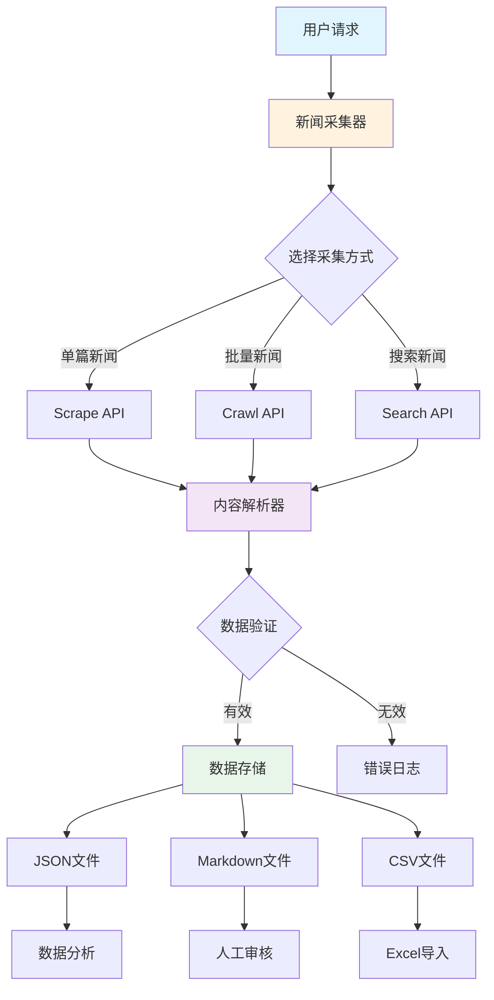

### 数据流程

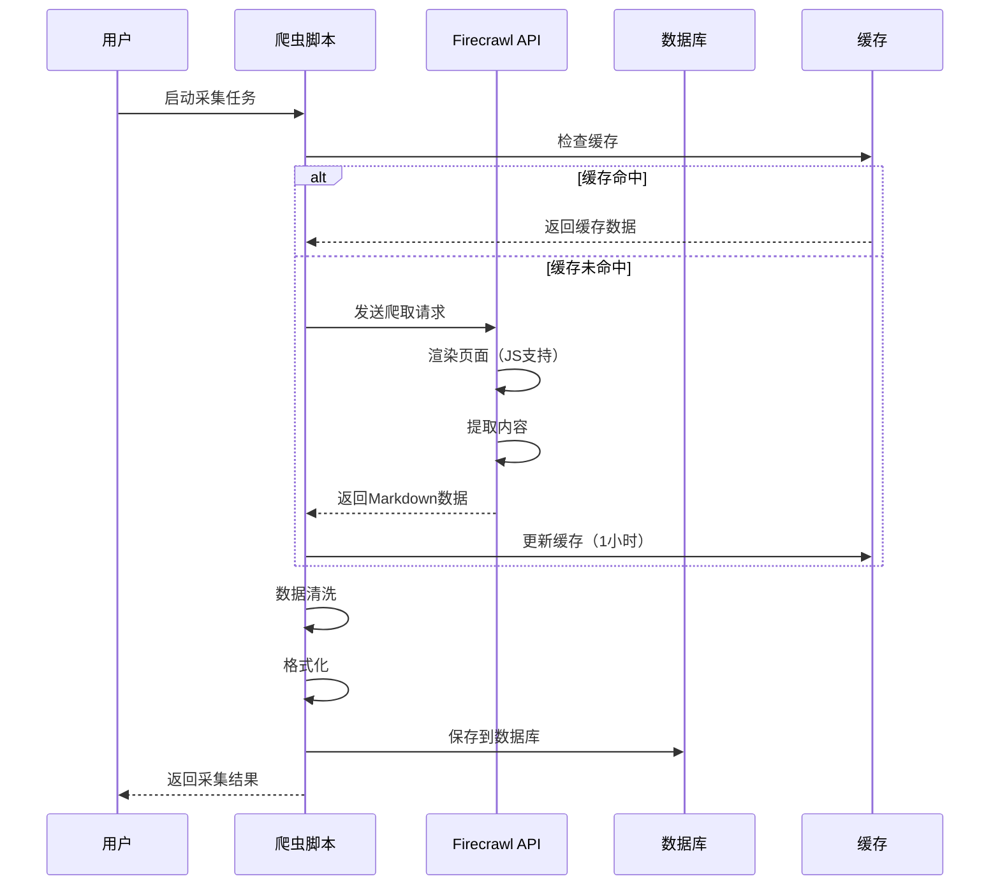

---

## 🍽️ 案例 02: 华人商家信息采集架构

### 系统架构

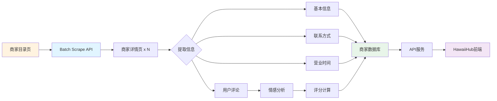

### 数据模型

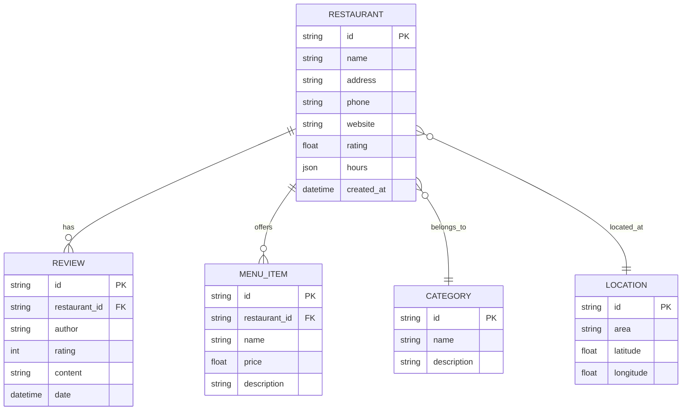

---

## 🏠 案例 03: 租房信息监控系统架构

### 实时监控流程

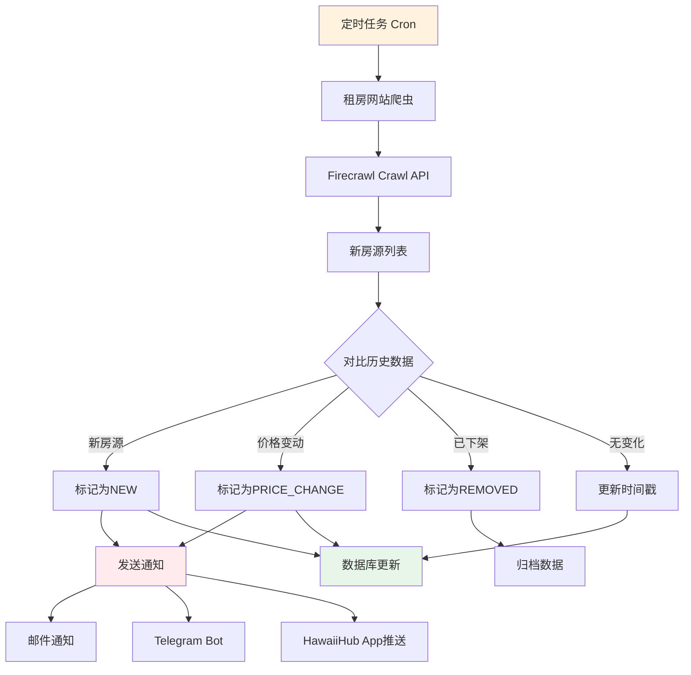

### Change Tracking机制

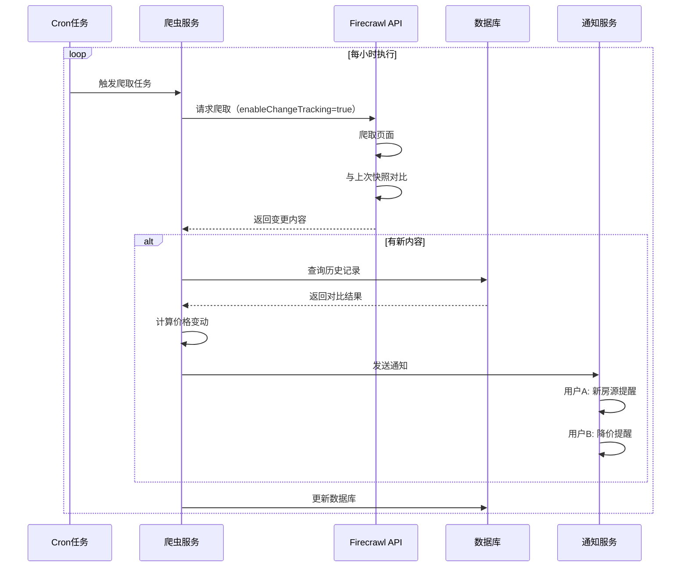

---

## 🤖 案例 11: 智能问答系统架构（RAG）

### RAG系统架构

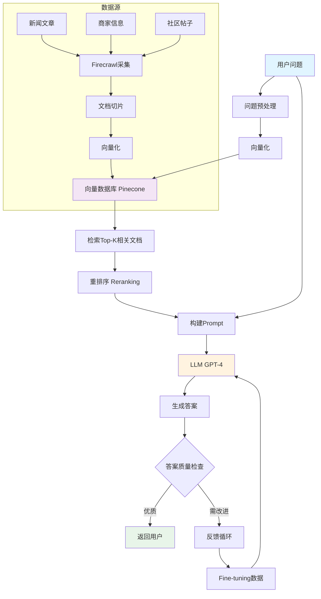

### 数据处理流程

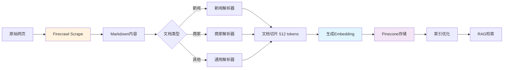

---

## 🏢 案例 15: HawaiiHub完整数据平台架构

### 微服务架构

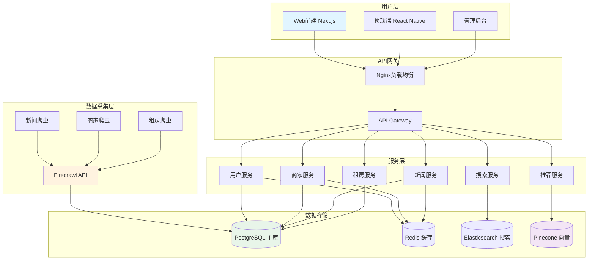

### 数据流转

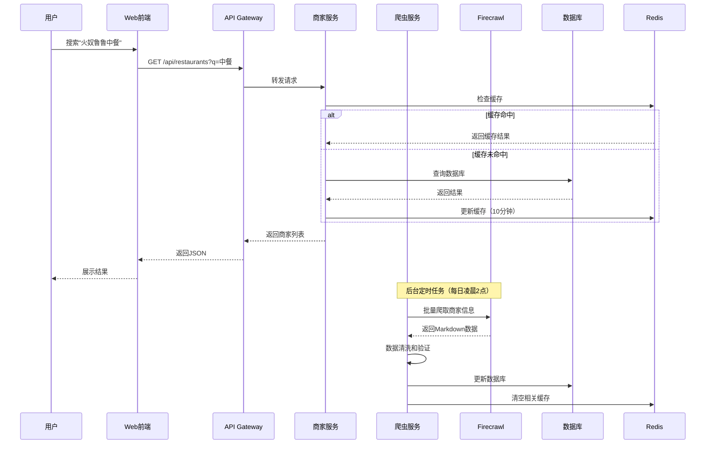

---

## 📊 技术栈总览

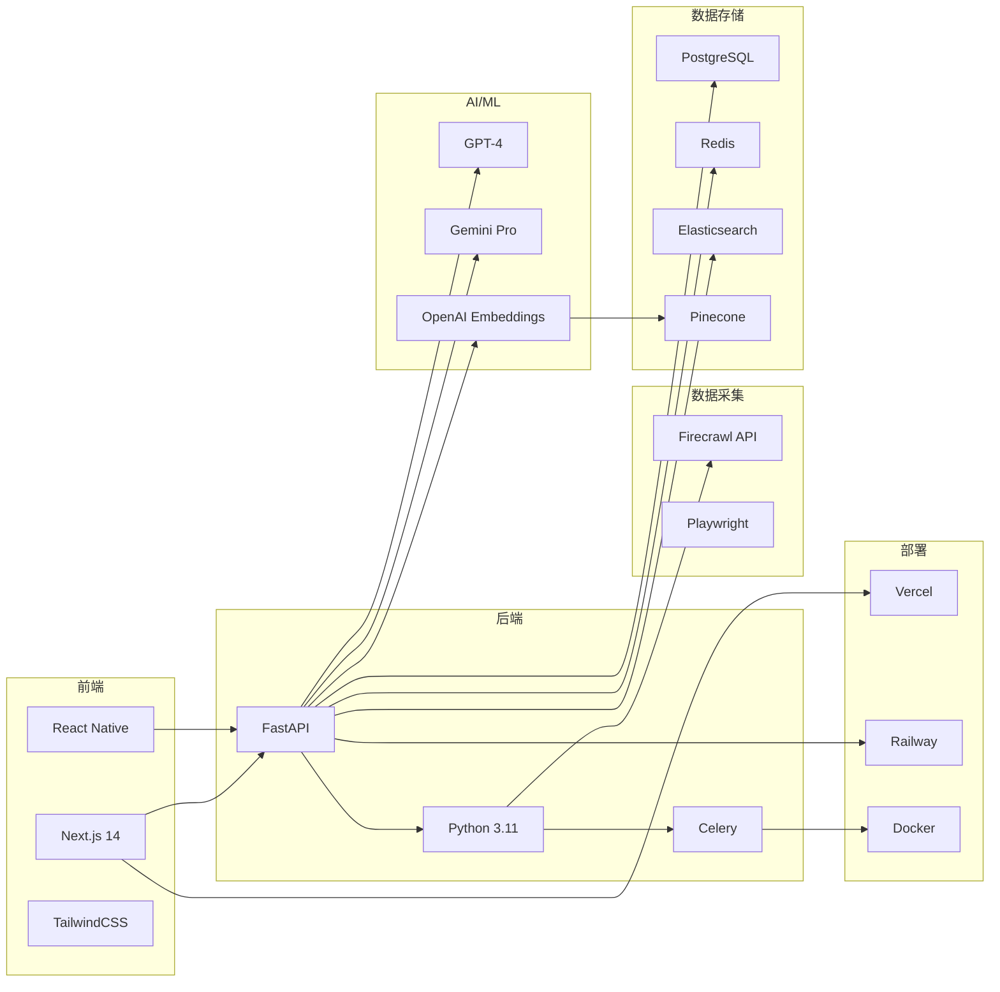

---

## 🎯 性能指标

### 系统性能对比

```mermaid
gantt
    title Firecrawl vs 传统爬虫性能对比
    dateFormat X
    axisFormat %s

    section 响应时间
    传统爬虫          :0, 5
    Firecrawl         :0, 1

    section 成功率
    传统爬虫          :0, 7
    Firecrawl         :0, 9.5

    section 开发时间
    传统爬虫          :0, 10
    Firecrawl         :0, 2
```

### 成本分析

| 方案      | 开发成本 | 运维成本   | 月度API费用 | 总成本（首年） |
| --------- | -------- | ---------- | ----------- | -------------- |
| 传统爬虫  | $5,000   | $800/月    | $0          | $14,600        |
| Firecrawl | $500     | $100/月    | $200/月     | $4,100         |
| **节省**  | **-90%** | **-87.5%** | +$200       | **-71.9%**     |

---

## 📈 数据增长趋势

```mermaid
xychart-beta
    title "HawaiiHub 数据增长（2025年预测）"
    x-axis [1月, 2月, 3月, 4月, 5月, 6月, 7月, 8月, 9月, 10月, 11月, 12月]
    y-axis "数据量（千条）" 0 --> 100
    line [5, 8, 12, 18, 25, 35, 45, 58, 70, 82, 92, 100]
    line [2, 5, 8, 12, 18, 25, 33, 42, 52, 63, 75, 88]
```

**说明**：

- 蓝线：新闻文章数量
- 橙线：商家信息数量

---

## 🏆 最佳实践总结

### 开发流程

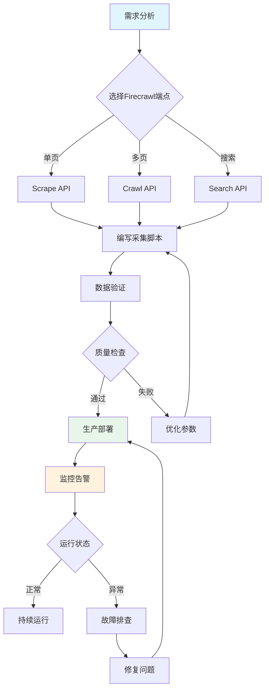

---

**文档版本**: v1.0
**最后更新**: 2025-10-27
**维护团队**: HawaiiHub AI Team
