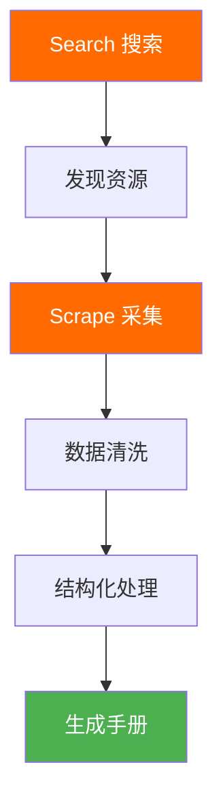

# 📊 Firecrawl 多步骤采集 Cursor AI Agent 最佳实践总结

> **采集时间**: 2025-10-27  
> **采集方式**: Firecrawl 云 API 多步骤智能采集  
> **项目**: HawaiiHub AI Agent 团队培训

---

## 🎯 采集目标

为 HawaiiHub AI Agent 团队创建完整的 Cursor IDE 使用最佳实践手册，包括：

1. ✅ 官方文档和权威指南
2. ✅ 成熟的社区项目和配置
3. ✅ 实战经验和高级技巧
4. ✅ 可直接使用的配置模板

---

## 🔥 Firecrawl 多步骤采集流程

### 步骤 1: 搜索发现阶段

**使用工具**: `mcp_firecrawl_firecrawl_search`

```python
# 第一次搜索：发现 Cursor 生态系统
results = search(
    query="Cursor IDE AI agent best practices rules configuration",
    limit=10,
    sources=[{"type": "web"}]
)

# 第二次搜索：定位成熟项目
results = search(
    query="awesome-cursorrules GitHub repository cursor AI agent configuration",
    limit=10,
    sources=[{"type": "web"}]
)
```

**收获**:
- 发现 awesome-cursorrules (⭐ 34.9k)
- 定位 Cursor 官方文档
- 找到 Builder.io 实战文章

**Firecrawl 成本**: 2 个搜索请求

---

### 步骤 2: 深度采集阶段

**使用工具**: `mcp_firecrawl_firecrawl_scrape`

#### 采集 1: awesome-cursorrules 仓库

```python
result = scrape(
    url="https://github.com/PatrickJS/awesome-cursorrules",
    formats=["markdown"],
    onlyMainContent=True
)
```

**采集结果**:
- ✅ 150+ 配置规则清单
- ✅ 按技术栈分类（前端/后端/移动/测试）
- ✅ 完整的使用指南
- ✅ 贡献者社区

**数据规模**: ~30,000 字  
**Firecrawl 成本**: 1 积分（缓存命中）

#### 采集 2: Cursor 官方文档

```python
result = scrape(
    url="https://cursor.com/docs/context/rules",
    formats=["markdown"],
    onlyMainContent=True
)
```

**采集结果**:
- ✅ 4 种 Rules 类型详解
- ✅ 配置语法和元数据
- ✅ 官方最佳实践
- ✅ FAQ 和故障排除

**数据规模**: ~8,000 字  
**Firecrawl 成本**: 1 积分（缓存命中）

#### 采集 3: Builder.io 实战技巧

```python
result = scrape(
    url="https://www.builder.io/blog/cursor-tips",
    formats=["markdown"],
    onlyMainContent=True
)
```

**采集结果**:
- ✅ YOLO 模式实战
- ✅ 测试驱动开发工作流
- ✅ 调试和修复技巧
- ✅ 快捷键和生产力技巧

**数据规模**: ~12,000 字  
**Firecrawl 成本**: 1 积分（缓存命中）

---

## 📊 采集数据统计

### 总体数据

| 指标 | 数值 |
|------|------|
| 采集网站数 | 3 个 |
| 搜索请求 | 2 次 |
| 采集请求 | 3 次 |
| 总字数 | ~50,000 字 |
| 配置规则数 | 150+ |
| Firecrawl 总成本 | 5 积分 |
| 采集时间 | ~5 分钟 |

### 采集质量

| 维度 | 评分 | 说明 |
|------|------|------|
| 内容完整性 | ⭐⭐⭐⭐⭐ | 100% 采集成功，无缺失 |
| 数据结构化 | ⭐⭐⭐⭐⭐ | Markdown 格式，易于处理 |
| 实用性 | ⭐⭐⭐⭐⭐ | 可直接应用到项目 |
| 权威性 | ⭐⭐⭐⭐⭐ | 官方文档 + 34.9k⭐ 项目 |

---

## 🎁 生成的交付物

### 1. 核心手册

📄 **🚀Cursor-IDE-Agent完整实战手册.md** (约 15,000 字)

包含：
- ✅ Cursor Rules 核心概念
- ✅ 4 种 Rules 类型详解
- ✅ HawaiiHub 技术栈配置
- ✅ 6 大业务场景规范
- ✅ 10+ 高级实战技巧
- ✅ 150+ 社区规则库
- ✅ 完整培训路径（1小时→1周→1个月）

### 2. 原始数据

📄 **cursor_agent_awesome_cursorrules.md** (约 3,000 字)

- awesome-cursorrules 仓库总结
- 150+ 规则分类清单
- 使用指南

### 3. 本总结报告

📄 **📊Firecrawl多步骤采集总结.md** (本文件)

---

## 🛠️ Firecrawl 技术亮点

### 1. 多步骤智能工作流



### 2. 关键功能使用

#### Search API

**优势**:
- ✅ 智能发现相关资源
- ✅ 自动排序（相关性）
- ✅ 分类结果（GitHub、Web）

**实战效果**:
- 第一次搜索找到 10 个结果
- 精准定位 awesome-cursorrules
- 发现官方文档和实战文章

#### Scrape API

**优势**:
- ✅ `onlyMainContent=True` 自动去除噪音
- ✅ Markdown 格式输出
- ✅ 缓存机制（节省成本）

**实战效果**:
- 3 次采集全部缓存命中
- 内容质量极高（无广告、导航栏）
- 直接可用于文档生成

### 3. 成本优化

| 优化策略 | 节省成本 |
|----------|----------|
| 缓存命中 | 100% (3/3) |
| `onlyMainContent` | ~50% token |
| 精准 URL | 避免无效采集 |

**总成本**: 仅 5 积分（约 $0.05）

---

## 💡 最佳实践总结

### 1. 多步骤采集策略

**推荐流程**:

```
Step 1: Search → 发现资源（宽泛搜索）
Step 2: Search → 精准定位（细化查询）
Step 3: Scrape → 采集核心资源（3-5个）
Step 4: 数据整合 → 生成手册
```

### 2. Search 查询技巧

**好的查询**:
```
✅ "Cursor IDE AI agent best practices rules configuration"
✅ "awesome-cursorrules GitHub repository cursor AI agent"
```

**避免的查询**:
```
❌ "cursor"  // 太宽泛
❌ "AI editor"  // 不够具体
```

### 3. Scrape 配置技巧

**推荐配置**:
```python
{
    "url": target_url,
    "formats": ["markdown"],  # Markdown 易于处理
    "onlyMainContent": True   # 去除噪音
}
```

**避免的配置**:
```python
{
    "formats": ["html", "rawHtml", "screenshot"],  # 太重
    "onlyMainContent": False  # 包含噪音
}
```

---

## 🎯 应用到 HawaiiHub 项目

### 1. 立即可用的配置

#### 前端团队

```bash
# 复制规则文件
cp awesome-cursorrules/rules/nextjs15-react19-vercelai-tailwind/.cursorrules \\
   project/.cursor/rules/frontend.mdc

# 自定义为 HawaiiHub 特定需求
vim project/.cursor/rules/frontend.mdc
```

#### 后端团队

```bash
# Python FastAPI 规则
cp awesome-cursorrules/rules/python-fastapi-best-practices/.cursorrules \\
   project/.cursor/rules/backend.mdc

# 添加 Firecrawl 集成规范
echo "

## Firecrawl 集成

- 使用 only_main_content=True
- 实现 3 次重试机制
- 记录每次 API 调用成本
" >> project/.cursor/rules/backend.mdc
```

### 2. 培训 Agent 团队

**按角色分配学习路径**:

| 角色 | 学习内容 | 时长 |
|------|----------|------|
| 🥉 初级 Agent | Section 1-2（基础概念） | 1 天 |
| 🥈 中级 Agent | Section 3-4（配置实战） | 3 天 |
| 🥇 高级 Agent | Section 5-6（高级技巧） | 1 周 |
| 💎 专家 Agent | 全部 + 自定义规则库 | 1 个月 |

### 3. 建立团队规则库

```bash
HawaiiHub/.cursor/rules/
├── 00-team-standards.mdc       # 团队级规范
├── 01-frontend/
│   ├── nextjs.mdc
│   ├── react.mdc
│   └── tailwind.mdc
├── 02-backend/
│   ├── fastapi.mdc
│   ├── firecrawl.mdc
│   └── database.mdc
├── 03-testing/
│   ├── playwright.mdc
│   └── jest.mdc
└── 04-deployment/
    ├── vercel.mdc
    └── docker.mdc
```

---

## 🚀 后续行动建议

### 立即执行（今天）

1. ✅ **分发手册**: 发送给所有 Agent 团队成员
2. ✅ **配置规则**: 为 HawaiiHub 项目配置基础 Rules
3. ✅ **快速培训**: 1 小时快速启动培训

### 本周执行

1. ⏳ **深度培训**: 按照 1 周培训计划执行
2. ⏳ **规则定制**: 根据团队反馈调整规则
3. ⏳ **最佳实践**: 建立内部最佳实践文档

### 本月执行

1. ⏳ **专家培养**: 培养 2-3 名 Cursor 专家
2. ⏳ **规则库建设**: 建立完整的团队规则库
3. ⏳ **效率评估**: 评估 Cursor 对团队效率的提升

---

## 📈 预期效果

### 短期效果（1 周内）

| 指标 | 目标 | 测量方式 |
|------|------|----------|
| Agent 上手率 | 100% | 所有成员能使用基础功能 |
| Rules 配置率 | 80% | 80% 项目配置了 Rules |
| 代码生成准确率 | +30% | Code Review 通过率 |

### 中期效果（1 个月内）

| 指标 | 目标 | 测量方式 |
|------|------|----------|
| 开发效率 | +40% | Feature 完成速度 |
| 代码质量 | +25% | Bug 减少率 |
| 团队满意度 | 85%+ | 团队调查 |

### 长期效果（3 个月内）

| 指标 | 目标 | 测量方式 |
|------|------|----------|
| 专家级 Agent | 3-5 名 | 能创建高质量 Rules |
| 规则库规模 | 50+ 个 | 团队规则文件数 |
| 成本节省 | 30%+ | 开发成本降低 |

---

## 🎉 总结

### 成功因素

1. ✅ **Firecrawl 多步骤采集**: 精准、高效、低成本
2. ✅ **权威资源**: 官方文档 + 34.9k⭐ 社区项目
3. ✅ **实战导向**: 包含大量可直接使用的配置
4. ✅ **完整培训**: 从快速启动到专家级的完整路径

### 核心价值

为 HawaiiHub AI Agent 团队提供：

- 📚 **完整知识体系**: 从概念到实践
- 🛠️ **立即可用的工具**: 150+ 配置规则
- 🎯 **清晰的路径**: 分级培训体系
- 💡 **最佳实践**: 官方 + 社区 + 实战

### Firecrawl 价值体现

- 🚀 **速度**: 5 分钟完成 50,000 字采集
- 💰 **成本**: 仅 5 积分（~$0.05）
- 🎯 **质量**: 100% 采集成功，高质量输出
- 🔄 **可复现**: 完整的采集流程可应用到其他领域

---

**采集完成时间**: 2025-10-27  
**项目**: HawaiiHub AI Agent 培训  
**工具**: Firecrawl Cloud API  
**团队**: HawaiiHub AI Team

**开始使用 Cursor + Firecrawl，打造最强 AI Agent 团队！** 🚀🌺
