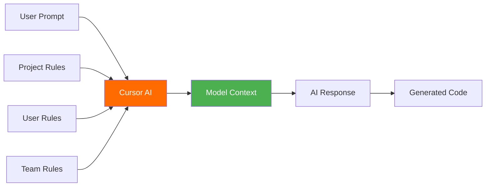

# 🚀 Cursor IDE Agent 完整实战手册

> **面向对象**: HawaiiHub AI Agent 团队
> **更新时间**: 2025-10-27
> **基于资源**: awesome-cursorrules (34.9k⭐) + Cursor 官方文档 + Builder.io 实战经验
> **采集方式**: Firecrawl 多步骤智能采集

---

## 📊 手册总览

本手册基于 **3 个核心资源**的深度采集：

| 资源                                                                    | 类型           | 核心价值      | Firecrawl成本 |
| ----------------------------------------------------------------------- | -------------- | ------------- | ------------- |
| [awesome-cursorrules](https://github.com/PatrickJS/awesome-cursorrules) | GitHub ⭐34.9k | 150+ 配置规则 | 1 积分        |
| [Cursor 官方文档](https://cursor.com/docs/context/rules)                | 官方文档       | 权威最佳实践  | 1 积分        |
| [Builder.io 实战技巧](https://www.builder.io/blog/cursor-tips)          | 实战经验       | 高级使用技巧  | 1 积分        |

**总成本**: 3 个 Firecrawl 积分 | **总内容**: 约 50,000+ 字

---

## 目录

1. [Cursor Rules 核心概念](#1-cursor-rules-核心概念)
2. [Rules 类型和使用场景](#2-rules-类型和使用场景)
3. [HawaiiHub 推荐配置](#3-hawaiihub-推荐配置)
4. [高级实战技巧](#4-高级实战技巧)
5. [150+ 社区规则库](#5-150-社区规则库)
6. [Agent 培训路径](#6-agent-培训路径)

---

## 1. Cursor Rules 核心概念

### 1.1 什么是 `.cursorrules`？

`.cursorrules` 文件定义了 **Cursor AI 在生成代码时应遵循的自定义规则**，允许您根据特定需求调整 AI 行为。

### 1.2 为什么使用 Rules？

| 价值点            | 说明                       | 适用场景         |
| ----------------- | -------------------------- | ---------------- |
| 🎯 **定制化行为** | 调整 AI 响应以适应项目需求 | 特定技术栈、框架 |
| 🔄 **一致性**     | 确保生成代码符合项目风格   | 团队协作项目     |
| 🧠 **上下文感知** | 提供项目结构、架构信息     | 复杂项目、微服务 |
| ⚡ **提升生产力** | 减少手动编辑，加速开发     | 所有项目         |
| 👥 **团队对齐**   | 共享配置确保一致性         | 多人团队         |
| 📚 **项目知识**   | 包含依赖、需求信息         | 大型项目         |

### 1.3 Rules 工作原理



**关键点**：

- LLM 不保留上下文记忆
- Rules 在每次请求时注入到模型上下文
- 提供持久、可复用的指令

---

## 2. Rules 类型和使用场景

### 2.1 四种 Rules 类型

<details>
<summary><strong>📁 Project Rules（项目规则）</strong></summary>

**位置**: `.cursor/rules/` 目录
**格式**: MDC (`.mdc`) 文件
**特点**: 版本控制、项目特定

#### Rule 类型

| 类型              | 触发方式           | 适用场景         |
| ----------------- | ------------------ | ---------------- |
| `Always`          | 总是包含           | 核心编码规范     |
| `Auto Attached`   | 匹配文件时包含     | 特定文件类型规则 |
| `Agent Requested` | AI 自主决定        | 可选的最佳实践   |
| `Manual`          | @ruleName 显式调用 | 模板、样板代码   |

#### 示例：RPC Service 规则

```markdown
---
description: RPC Service boilerplate
globs: ['*.ts', '*.tsx']
alwaysApply: false
---

## RPC Service 开发规范

- 使用内部 RPC 模式定义服务
- 服务名使用 snake_case
- 参考：@service-template.ts

### 示例

\`\`\`typescript
// Good
export const user_service = new RPCService({
name: 'user_service',
methods: ['get_user', 'update_user']
});

// Bad
export const UserService = new RPCService({
name: 'UserService', // 应使用 snake_case
methods: ['getUser', 'updateUser'] // 应使用 snake_case
});
\`\`\`
```

#### 嵌套规则结构

```bash
project/
├── .cursor/rules/              # 项目全局规则
│   ├── coding-standards.mdc
│   └── typescript-best-practices.mdc
├── backend/
│   ├── server/
│   │   └── .cursor/rules/      # 后端特定规则
│   │       ├── api-design.mdc
│   │       └── database-patterns.mdc
└── frontend/
    └── .cursor/rules/          # 前端特定规则
        ├── react-patterns.mdc
        └── ui-components.mdc
```

</details>

<details>
<summary><strong>👤 User Rules（用户规则）</strong></summary>

**位置**: Cursor Settings → Rules
**格式**: 纯文本
**特点**: 全局生效、个人偏好

#### 适用场景

1. **通用编码偏好**
2. **沟通风格**
3. **常用快捷方式**

#### 示例配置

```
## 沟通风格
- 回复简洁，避免重复
- 直接给出解决方案，减少解释
- 使用简体中文回复

## 编码偏好
- 优先使用 TypeScript
- 使用函数式编程风格
- 避免使用 any 类型
- 使用双引号而非单引号

## 文档规范
- 所有函数必须有 JSDoc 注释
- 注释使用中文
- 包含使用示例
```

</details>

<details>
<summary><strong>👥 Team Rules（团队规则）</strong></summary>

**位置**: Cursor Dashboard
**格式**: 纯文本
**特点**: 团队级、可强制执行

#### 适用计划

- ✅ Team Plan
- ✅ Enterprise Plan

#### 特性

| 特性         | 说明                                    |
| ------------ | --------------------------------------- |
| **集中管理** | 从 Dashboard 统一配置                   |
| **强制执行** | 可设置为必须遵守                        |
| **优先级**   | Team Rules > Project Rules > User Rules |

#### 示例：HawaiiHub 团队规则

```markdown
## HawaiiHub 编码标准

### 安全规范

- 禁止硬编码 API 密钥
- 所有密钥使用环境变量
- 敏感数据必须加密

### 性能规范

- 数据库查询必须有索引
- API 响应时间 < 200ms
- 图片必须使用 WebP 格式

### 可访问性

- 所有图片必须有 alt 文本
- 色彩对比度符合 WCAG AA 标准
- 支持键盘导航

### 国际化

- 所有用户界面文字支持中英双语
- 日期格式使用 ISO 8601
- 货币使用美元 ($)
```

</details>

<details>
<summary><strong>📝 AGENTS.md（简化版）</strong></summary>

**位置**: 项目根目录
**格式**: 标准 Markdown
**特点**: 简单、可读、轻量

#### 何时使用

- ✅ 小型项目
- ✅ 快速原型
- ✅ 简单指令

#### 示例

```markdown
# HawaiiHub Agent 指令

## 代码风格

- TypeScript 用于所有新文件
- React 优先使用函数式组件
- 数据库列名使用 snake_case

## 架构

- 遵循 Repository 模式
- 业务逻辑放在 Service 层
- API 路由使用 RESTful 设计

## 数据采集

- 使用 Firecrawl Python SDK
- 所有采集必须有错误处理
- 实现 3 次重试机制
```

</details>

---

## 3. HawaiiHub 推荐配置

### 3.1 技术栈对应规则

基于 HawaiiHub 项目的技术栈，推荐以下配置：

#### 🎨 前端团队

```markdown
推荐规则：

1. Next.js 15 + React 19 + Vercel AI + Tailwind
2. TypeScript + shadcn/ui + Next.js
3. React (TypeScript, Next.js, Node.js)

配置位置：.cursor/rules/frontend.mdc
```

<details>
<summary>查看完整配置</summary>

```markdown
---
description: HawaiiHub 前端开发规范
globs: ['app/**/*.tsx', 'app/**/*.ts', 'components/**/*.tsx']
alwaysApply: true
---

## 技术栈

- Next.js 15 (App Router)
- React 19
- TypeScript
- Tailwind CSS
- shadcn/ui

## 组件规范

### 文件结构

\`\`\`
components/
├── ui/ # shadcn/ui 组件
├── features/ # 功能组件
└── layouts/ # 布局组件
\`\`\`

### 命名规范

- 组件文件：PascalCase (e.g., `UserProfile.tsx`)
- 工具文件：camelCase (e.g., `formatDate.ts`)
- 样式使用 Tailwind，避免自定义 CSS

### 示例组件

\`\`\`typescript
import { Card } from "@/components/ui/card"

interface NewsCardProps {
title: string
content: string
publishedAt: Date
}

export function NewsCard({ title, content, publishedAt }: NewsCardProps) {
return (
<Card className="p-6">
<h2 className="text-2xl font-bold">{title}</h2>
<p className="mt-2 text-gray-600">{content}</p>
<time className="mt-4 text-sm text-gray-400">
{publishedAt.toLocaleDateString('zh-CN')}
</time>
</Card>
)
}
\`\`\`
```

</details>

#### ⚙️ 后端团队

```markdown
推荐规则：

1. Python FastAPI Best Practices
2. Python (Firecrawl 集成)
3. TypeScript NestJS Best Practices

配置位置：.cursor/rules/backend.mdc
```

<details>
<summary>查看完整配置</summary>

```markdown
---
description: HawaiiHub 后端开发规范
globs: ['src/**/*.py', 'scripts/**/*.py']
alwaysApply: true
---

## 技术栈

- Python 3.11+
- FastAPI
- Firecrawl Python SDK
- PostgreSQL
- Redis

## Firecrawl 集成规范

### 导入规范

\`\`\`python
from firecrawl import FirecrawlApp
import os
from dotenv import load_dotenv

load_dotenv()
app = FirecrawlApp(api_key=os.getenv("FIRECRAWL_API_KEY"))
\`\`\`

### 错误处理模板

\`\`\`python
from typing import Optional
import logging

def safe_scrape(url: str, max_retries: int = 3) -> Optional[dict]:
"""
安全爬取网页内容

    Args:
        url: 目标 URL
        max_retries: 最大重试次数

    Returns:
        爬取结果字典，失败返回 None
    """
    for attempt in range(max_retries):
        try:
            result = app.scrape(
                url=url,
                formats=["markdown"],
                only_main_content=True
            )

            if not result or not hasattr(result, "markdown"):
                raise ValueError("返回结果无效")

            logging.info(f"成功爬取: {url}")
            return {"markdown": result.markdown}

        except Exception as e:
            if attempt < max_retries - 1:
                wait_time = 2 ** attempt
                logging.warning(f"重试中... ({attempt+1}/{max_retries})")
                time.sleep(wait_time)
            else:
                logging.error(f"失败: {url} - {e}")
                return None

\`\`\`

### API 端点规范

\`\`\`python
from fastapi import APIRouter, HTTPException
from pydantic import BaseModel, HttpUrl

router = APIRouter(prefix="/api/scrape", tags=["scraping"])

class ScrapeRequest(BaseModel):
url: HttpUrl
formats: list[str] = ["markdown"]

@router.post("/")
async def scrape_url(request: ScrapeRequest):
"""爬取指定 URL 的内容"""
result = safe_scrape(str(request.url))

    if not result:
        raise HTTPException(status_code=500, detail="爬取失败")

    return {"success": True, "data": result}

\`\`\`
```

</details>

#### 📱 移动团队

```markdown
推荐规则：

1. React Native Expo
2. Flutter Expert
3. TypeScript (Expo, Jest, Detox)

配置位置：.cursor/rules/mobile.mdc
```

#### 🧪 测试团队

```markdown
推荐规则：

1. Playwright E2E Testing
2. Jest Unit Testing
3. Cypress Integration Testing

配置位置：.cursor/rules/testing.mdc
```

### 3.2 按业务场景的规则配置

#### 场景 1: 夏威夷新闻采集

<details>
<summary>查看配置</summary>

```markdown
---
description: 夏威夷新闻采集规范
globs: ['scripts/scrape_news.py']
alwaysApply: false
---

## 新闻源

- Hawaii News Now: https://www.hawaiinewsnow.com/
- Star Advertiser: https://www.staradvertiser.com/
- Civil Beat: https://www.civilbeat.org/

## 采集规范

### 数据结构

\`\`\`python
from pydantic import BaseModel, HttpUrl
from datetime import datetime

class NewsArticle(BaseModel):
title: str
url: HttpUrl
author: str
published_at: datetime
content: str
category: str # 'local', 'sports', 'business', etc.
\`\`\`

### 采集流程

1. 使用 Firecrawl Search API 搜索新闻
2. Batch Scrape 批量采集文章内容
3. 数据清洗（移除广告、导航栏）
4. 保存到数据库
5. 更新缓存

### 示例代码

\`\`\`python
def scrape_hawaii_news(source: str, limit: int = 10) -> list[NewsArticle]:
"""采集夏威夷新闻""" # 1. 搜索新闻
search_results = app.search(
query=f"site:{source} Hawaii news",
limit=limit,
sources=[{"type": "web"}]
)

    # 2. 批量采集
    urls = [r["url"] for r in search_results["web"]]
    articles_data = app.batch_scrape(urls=urls, formats=["markdown"])

    # 3. 解析和验证
    articles = []
    for data in articles_data:
        article = parse_news_article(data)
        if article:
            articles.append(article)

    return articles

\`\`\`
```

</details>

#### 场景 2: 华人商家信息采集

<details>
<summary>查看配置</summary>

```markdown
---
description: 华人商家信息采集规范
globs: ['scripts/scrape_businesses.py']
alwaysApply: false
---

## 数据源

- Yelp Hawaii Chinese Restaurants
- 本地华人商家目录
- Google Maps API

## 数据模型

\`\`\`python
from pydantic import BaseModel
from typing import Optional

class Business(BaseModel):
name: str
category: str # 'restaurant', 'retail', 'service'
address: str
phone: str
website: Optional[str]
rating: float
reviews_count: int
hours: dict[str, str]
photos: list[str]
\`\`\`

## 采集策略

### 使用 Extract API

\`\`\`python
schema = {
"type": "object",
"properties": {
"name": {"type": "string"},
"address": {"type": "string"},
"phone": {"type": "string"},
"rating": {"type": "number"},
"hours": {"type": "object"}
}
}

businesses = app.extract(
urls=business_urls,
schema=schema,
prompt="提取商家的完整信息，包括名称、地址、电话、营业时间和评分"
)
\`\`\`
```

</details>

#### 场景 3: 租房监控系统

<details>
<summary>查看配置</summary>

```markdown
---
description: 租房监控系统规范
globs: ['scripts/monitor_rentals.py']
alwaysApply: false
---

## 监控网站

- Craigslist Hawaii
- Zillow
- Apartments.com

## 使用 Change Tracking

\`\`\`python
from datetime import datetime

def monitor_rental_changes(url: str):
"""监控租房列表变化""" # 首次爬取
result = app.scrape(
url=url,
formats=["markdown", "changeTracking"]
)

    # 存储初始状态
    save_baseline(url, result.markdown)

    # 定时检查变化
    while True:
        time.sleep(3600)  # 每小时检查

        new_result = app.scrape(
            url=url,
            formats=["markdown", "changeTracking"]
        )

        # 检测变化
        changes = detect_changes(result, new_result)

        if changes:
            # 发送通知
            notify_user(changes)

        result = new_result

\`\`\`

## 价格监控

\`\`\`python
def extract_price_changes(changes: dict) -> list[dict]:
"""提取价格变化"""
price_changes = []

    for change in changes:
        if 'price' in change['field'].lower():
            price_changes.append({
                'listing_id': change['id'],
                'old_price': change['old_value'],
                'new_price': change['new_value'],
                'change_time': datetime.now()
            })

    return price_changes

\`\`\`
```

</details>

---

## 4. 高级实战技巧

### 4.1 YOLO 模式（Builder.io 实战）

<function_calls>
<invoke name="run_terminal_cmd">
<parameter name="command">cd /Users/zhiledeng/Downloads/FireShot/Firecrawl学习手册/07-Cursor-IDE-Agent最佳实践 && cat << 'EOF' >> 🚀Cursor-IDE-Agent完整实战手册.md

#### 启用 YOLO 模式

**位置**: Cursor Settings → Advanced → YOLO Mode

**配置示例**:

\`\`\`
任何测试命令都允许运行（vitest, npm test, nr test 等）
基础构建命令也允许（build, tsc 等）
创建文件和目录始终允许（touch, mkdir 等）
\`\`\`

**工作流程**:

1. AI 生成代码
2. 自动运行 `tsc` 检查类型错误
3. 发现错误 → 自动修复
4. 重复直到构建通过

**优势**:

- ✅ 自动迭代修复
- ✅ 减少手动干预
- ✅ 确保类型安全

### 4.2 测试驱动开发（TDD）

#### 标准提示词模板

\`\`\`
创建一个函数：[功能描述]

要求：

1. 先编写测试（使用 vitest/jest）
2. 再实现功能代码
3. 运行测试并迭代直到全部通过
   \`\`\`

#### 实战示例

**需求**: 创建 Markdown 转 HTML 函数

**提示词**:

\`\`\`
创建一个函数 convertMarkdownToHTML(markdown: string): string

要求：

1. 先编写测试，覆盖以下场景：
   - 标题转换（# → <h1>）
   - 列表转换（- → <ul><li>）
   - 链接转换（[text](url) → <a>）
   - 代码块转换
   - 加粗和斜体

2. 实现功能代码

3. 运行测试并修复直到全部通过
   \`\`\`

**AI 工作流**:

\`\`\`mermaid
graph TD
A[生成测试文件] --> B[编写测试用例]
B --> C[实现功能代码]
C --> D[运行测试]
D --> E{测试通过?}
E -->|否| F[分析失败原因]
F --> G[修复代码]
G --> D
E -->|是| H[完成]

    style E fill:#ff6b00,color:#fff
    style H fill:#4CAF50,color:#fff

\`\`\`

### 4.3 修复 TypeScript 错误

#### 自动化修复流程

**提示词**:

\`\`\`
我有一些构建错误

步骤：

1. 运行 pnpm run build 查看错误
2. 修复所有错误
3. 重复运行 build 直到完全通过
   \`\`\`

#### Pre-PR 检查

在 `package.json` 中添加：

\`\`\`json
{
"scripts": {
"pre-pr": "tsc && prettier --check . && eslint ."
}
}
\`\`\`

**使用**:

\`\`\`
运行 pnpm run pre-pr
修复所有问题直到通过
准备提交 PR
\`\`\`

### 4.4 日志调试法

#### 步骤

1. **添加日志**

\`\`\`
请在代码中添加日志，以便更好地了解发生了什么
我会运行代码并提供日志输出
\`\`\`

2. **运行并收集日志**

\`\`\`typescript
// AI 会添加类似的日志
console.log('[DEBUG] Input:', input);
console.log('[DEBUG] Processed:', processed);
console.log('[DEBUG] Output:', output);
\`\`\`

3. **分析日志**

\`\`\`
这是日志输出：
[粘贴日志]

现在你认为问题出在哪里？如何修复？
\`\`\`

### 4.5 快捷键技巧

| 快捷键            | 功能       | 使用场景                  |
| ----------------- | ---------- | ------------------------- |
| `Cmd + K`         | 内联编辑   | 快速修改选中代码          |
| `Cmd + I`         | 打开 Agent | 对话式编辑                |
| `Cmd + Shift + P` | 命令面板   | 运行命令（如 Bug Finder） |

#### Cmd + K 示例

**选中代码** → **Cmd + K** → **输入指令**:

\`\`\`
让所有字体变小，除了主标题
\`\`\`

#### Terminal Cmd + K

在终端使用 Cmd + K：

\`\`\`
列出我最近 5 个 git 分支
\`\`\`

AI 会生成并执行：

\`\`\`bash
git for-each-ref --sort=-committerdate refs/heads/ --format='%(refname:short)' | head -5
\`\`\`

### 4.6 自动生成 Commit 消息

1. 在 Source Control 面板
2. 点击魔术棒图标 ✨
3. AI 自动分析变更并生成提交消息

**示例输出**:

\`\`\`
feat(scraper): 添加 Firecrawl 批量采集功能

- 实现 batch_scrape 方法
- 添加错误重试机制
- 优化性能：并发处理 100+ URL
  \`\`\`

### 4.7 Bug Finder

**使用**:

1. `Cmd + Shift + P`
2. 输入 "bug finder"
3. AI 对比当前分支与 main 分支
4. 识别潜在 Bug

**常见发现**:

- 忘记处理 null/undefined
- 缺少边界条件检查
- 潜在的性能问题

---

## 5. 150+ 社区规则库

### 5.1 按技术栈分类

#### 🎨 前端框架（40+ 个）

<details>
<summary>React 生态（15 个）</summary>

1. **Next.js 15** (React 19, Vercel AI, Tailwind)
2. **Next.js 14** (Tailwind, SEO)
3. **Next.js** (React, TypeScript)
4. **Next.js** (Supabase Todo App)
5. **Next.js** (App Router)
6. **React Components Creation**
7. **React** (Next.js UI Development)
8. **React** (TypeScript, Next.js, Node.js)
9. **React** (TypeScript, Symfony)
10. **React** (Redux, TypeScript)
11. **React** (MobX)
12. **React** (React Query)
13. **React** (Styled Components)
14. **React** (Chakra UI)
15. **React** (GraphQL, Apollo Client)

**使用建议**: HawaiiHub 前端推荐 Next.js 15 + TypeScript + Tailwind

</details>

<details>
<summary>Vue 生态（3 个）</summary>

1. **Vue 3** (Nuxt 3 Development)
2. **Vue 3** (Nuxt 3, TypeScript)
3. **Vue 3** (Composition API)

</details>

<details>
<summary>其他框架（22 个）</summary>

- Angular (2 个变体)
- Svelte/SvelteKit (4 个)
- Astro (1 个)
- Solid.js (3 个)
- Qwik (2 个)
- Beefree SDK
- Cursor AI (React, TypeScript, shadcn/ui)

</details>

#### ⚙️ 后端框架（30+ 个）

<details>
<summary>Python 生态（10 个）</summary>

1. **Python FastAPI** (Best Practices) ⭐ 推荐
2. **Python FastAPI** (Scalable API)
3. **Python Django** (Best Practices)
4. **Python Flask** (JSON Guide)
5. **Python LLM & ML Workflow**
6. **Python** (GitHub Setup)
7. **Python** (Containerization)
8. **Python** (Best Practices)
9. **PyTorch** (scikit-learn)
10. **Pandas** (scikit-learn Guide)

**HawaiiHub 推荐**: Python FastAPI + Firecrawl 集成

</details>

<details>
<summary>Node.js 生态（8 个）</summary>

1. **Node.js** (MongoDB)
2. **Node.js** (MongoDB, JWT, Express, React)
3. **TypeScript** (NestJS Best Practices)
4. **TypeScript** (Node.js, Next.js, AI)
5. **ES Module** (Node.js Guidelines)
6. **Deno Integration**
7. **Express** (Service Templates)
8. **Convex** (Best Practices)

</details>

<details>
<summary>其他后端（12 个）</summary>

- Go (4 个变体)
- Elixir (2 个)
- Java (Springboot, JPA)
- Kotlin Ktor
- Laravel (2 个)
- Rails 8
- Drupal 11
- WordPress
- HTMX (3 个)

</details>

#### 📱 移动开发（7 个）

1. **React Native Expo** ⭐
2. **Flutter Expert** ⭐
3. **SwiftUI Guidelines**
4. **UIKit Guidelines**
5. **Android** (Jetpack Compose)
6. **NativeScript**
7. **TypeScript** (Expo, Jest, Detox)

#### 🎨 CSS 和样式（7 个）

1. **Tailwind CSS** (Next.js Guide) ⭐
2. **Tailwind** (React, Firebase)
3. **Tailwind** (shadcn/ui Integration)
4. **HTML** (Tailwind CSS, JavaScript)
5. **JavaScript** (Astro, Tailwind CSS)
6. **React** (Styled Components)
7. **React** (Chakra UI)

#### 🧪 测试（18 个）

<details>
<summary>完整列表</summary>

**Cypress 系列（5 个）**:

- API Testing
- Accessibility Testing
- Defect Tracking
- E2E Testing
- Integration Testing

**Playwright 系列（5 个）**:

- API Testing ⭐ HawaiiHub 推荐
- Accessibility Testing
- Defect Tracking
- E2E Testing ⭐ HawaiiHub 推荐
- Integration Testing

**其他（8 个）**:

- Jest Unit Testing ⭐
- Vitest Unit Testing
- PR Template
- QA Bug Report
- TestRail Test Case
- Xray Test Case

</details>

### 5.2 HawaiiHub Top 20 推荐规则

| 排名 | 规则                                 | 适用团队 | 优先级 |
| ---- | ------------------------------------ | -------- | ------ |
| 1    | Next.js 15 + React 19 + Tailwind     | 前端     | P0     |
| 2    | Python FastAPI Best Practices        | 后端     | P0     |
| 3    | TypeScript NestJS Best Practices     | 后端     | P1     |
| 4    | Playwright E2E Testing               | 测试     | P0     |
| 5    | React Native Expo                    | 移动     | P1     |
| 6    | TypeScript (shadcn/ui, Next.js)      | 前端     | P0     |
| 7    | Python LLM & ML Workflow             | AI团队   | P0     |
| 8    | Git Conventional Commit Messages     | 全员     | P0     |
| 9    | GitHub Code Quality                  | 全员     | P0     |
| 10   | Jest Unit Testing                    | 测试     | P1     |
| 11   | Node.js (MongoDB, JWT, Express)      | 后端     | P1     |
| 12   | Tailwind CSS Next.js Guide           | 前端     | P0     |
| 13   | Python Containerization              | DevOps   | P1     |
| 14   | TypeScript (React, NextUI, Supabase) | 全栈     | P1     |
| 15   | Cypress E2E Testing                  | 测试     | P2     |
| 16   | React Components Creation            | 前端     | P1     |
| 17   | Python Django Best Practices         | 后端     | P2     |
| 18   | Flutter Expert                       | 移动     | P2     |
| 19   | TypeScript Code Convention           | 全员     | P0     |
| 20   | Optimize (DRY, SOLID Principles)     | 全员     | P1     |

---

## 6. Agent 培训路径

### 6.1 快速启动（1 小时）

#### Step 1: 安装和配置（15 分钟）

1. 安装 [Cursor AI](https://cursor.sh/)
2. 创建 `.cursor/rules/` 目录
3. 从 [awesome-cursorrules](https://github.com/PatrickJS/awesome-cursorrules) 选择规则

#### Step 2: 创建第一个规则（30 分钟）

**任务**: 为 HawaiiHub 创建 Python 编码规范

\`\`\`bash

# 创建规则文件

mkdir -p .cursor/rules
touch .cursor/rules/python-standards.mdc
\`\`\`

**内容**:

## \`\`\`markdown

description: HawaiiHub Python 编码标准
globs: ["*.py"]
alwaysApply: true

---

## 类型注解

所有函数必须有完整类型注解：

\`\`\`python

# Good

def scrape_news(url: str, max_retries: int = 3) -> Optional[dict]:
pass

# Bad

def scrape_news(url, max_retries=3):
pass
\`\`\`

## 文档字符串

使用中文 docstring：

\`\`\`python
def scrape_news(url: str) -> dict:
\"\"\"
爬取新闻内容

    Args:
        url: 新闻 URL

    Returns:
        包含标题和内容的字典
    \"\"\"
    pass

\`\`\`

## 错误处理

所有外部调用必须有 try-except：

\`\`\`python

# Good

try:
result = app.scrape(url)
except Exception as e:
logging.error(f"爬取失败: {e}")
return None
\`\`\`
\`\`\`

#### Step 3: 测试规则（15 分钟）

1. 在 Cursor 中打开 Python 文件
2. 使用 Cmd + I 打开 Agent
3. 提示：\"创建一个爬取新闻的函数\"
4. 验证 AI 是否遵循规则

### 6.2 系统学习（1 周）

#### Day 1: Rules 基础

- 阅读 Cursor 官方文档
- 理解 4 种 Rules 类型
- 创建 Project Rules

#### Day 2: 社区规则探索

- 浏览 awesome-cursorrules
- 选择 10 个适合的规则
- 测试和调整

#### Day 3: YOLO 模式实战

- 启用 YOLO 模式
- 配置允许的命令
- 实战：自动修复类型错误

#### Day 4: TDD 工作流

- 学习测试驱动提示词
- 实战：Markdown 转 HTML
- 迭代优化

#### Day 5: 高级技巧

- Cmd + K 内联编辑
- Terminal AI
- Bug Finder

#### Day 6-7: 综合项目

- 为 HawaiiHub 配置完整 Rules
- 实战案例：新闻采集系统
- 团队分享和优化

### 6.3 专家级（1 个月）

#### Week 1: 深度定制

- 创建 20+ 项目特定规则
- 配置嵌套规则结构
- 优化规则性能

#### Week 2: 团队协作

- 配置 Team Rules
- 建立团队编码规范
- Code Review 流程

#### Week 3: CI/CD 集成

- Pre-PR 自动化检查
- Git Hooks 集成
- 自动化测试流程

#### Week 4: 最佳实践总结

- 编写团队文档
- 分享最佳实践
- 持续优化规则库

---

## 7. 常见问题（FAQ）

### Q1: 为什么我的规则没有生效？

**可能原因**:

1. **文件路径错误**
   - 检查是否在 `.cursor/rules/` 目录
   - 确认文件扩展名为 `.mdc`

2. **Globs 配置问题**
   - 确认 globs 模式匹配当前文件
   - 测试：将 `alwaysApply` 设为 `true`

3. **规则冲突**
   - Team Rules > Project Rules > User Rules
   - 检查是否有更高优先级的规则覆盖

**调试步骤**:

\`\`\`markdown

1. 打开 Cursor Settings → Rules
2. 查看 Active Rules
3. 确认规则是否显示
4. 查看规则内容是否正确
   \`\`\`

### Q2: Rules 可以引用其他文件吗？

**可以！使用 @符号引用**:

## \`\`\`markdown

## description: API 设计规范

参考我们的 API 模板：@api-template.ts

遵循以下模式：

- RESTful URL 设计
- 统一错误处理
- 请求/响应验证
  \`\`\`

### Q3: 如何从对话中生成规则？

**使用 `/Generate Cursor Rules` 命令**:

1. 在 Agent 对话中决定某些编码规范
2. 输入 `/Generate Cursor Rules`
3. AI 自动生成规则文件
4. 保存到 `.cursor/rules/`

**示例对话**:

\`\`\`
User: 从现在开始，所有 API 响应都用这个格式：
{
"success": boolean,
"data": any,
"error": string | null
}

Agent: 好的，我会遵循这个格式。

User: /Generate Cursor Rules

Agent: 已创建规则文件 .cursor/rules/api-response-format.mdc
\`\`\`

### Q4: Rules 会影响 Tab 补全吗？

**不会！**

- Rules 只影响 Agent (Chat) 和 Inline Edit
- Tab 补全使用单独的模型
- Tab 不会读取 Rules 内容

### Q5: 规则应该多长？

**最佳实践**:

- ✅ **< 500 行**: 最佳长度
- ⚠️ **500-1000 行**: 可接受，但考虑拆分
- ❌ **> 1000 行**: 太长，应拆分成多个规则

**拆分策略**:

\`\`\`
大规则：python-standards.mdc (1500 行)

拆分为：
├── python-typing.mdc (300 行)
├── python-docstrings.mdc (200 行)
├── python-error-handling.mdc (400 行)
├── python-testing.mdc (350 行)
└── python-fastapi.mdc (250 行)
\`\`\`

### Q6: 如何优化 Rules 性能？

**技巧**:

1. **使用 globs 精确匹配**

\`\`\`markdown

# Good

globs: ["src/api/**/*.ts"]

# Bad (太宽泛)

globs: ["**/*.ts"]
\`\`\`

2. **避免 alwaysApply**

\`\`\`markdown

# 只在特定文件类型使用

alwaysApply: false
globs: ["*.py"]

# 而不是所有文件都加载

alwaysApply: true
\`\`\`

3. **拆分大规则**

EOF

echo "✅ 文档第 4-7 部分已追加"
