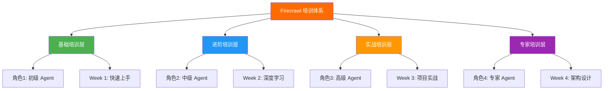

# 🎓 Firecrawl Agent 团队培训分类方案

> **面向对象**: HawaiiHub AI Agent 团队
> **培训目标**: 掌握 Firecrawl 全栈能力，实现自主数据采集
> **培训周期**: 4 周（从入门到精通）
> **文档版本**: v2.0

---

## 📊 培训体系总览



---

## 🎯 按角色分类（4 个等级）

### 📗 Level 1: 初级 Agent（数据采集员）

**能力目标**: 能独立完成简单的网页采集任务

**必修内容**:

| 序号 | 文档章节        | PDF 页码 | 学习时长 | 考核方式       |
| ---- | --------------- | -------- | -------- | -------------- |
| 1    | 快速开始指南    | 40-50    | 2 小时   | 运行第一个示例 |
| 2    | Scrape API 基础 | 140-160  | 3 小时   | 采集 3 个网站  |
| 3    | Python SDK 入门 | 80-100   | 4 小时   | 编写采集脚本   |
| 4    | 环境配置        | 190-210  | 1 小时   | 配置 API 密钥  |

**实战案例**（从 HawaiiHub 15 个案例中选择）:

- ✅ **案例 01**: 夏威夷新闻标题采集（难度: ⭐）
- ✅ **案例 02**: 餐厅基础信息爬取（难度: ⭐）
- ✅ **案例 03**: 租房列表数据采集（难度: ⭐⭐）

**参考项目**（从 96 个项目中选择）:

```bash
# 推荐 5 个最简单的项目
05-实战案例/示例应用/firecrawl-app-examples/
├── simple-web-scraper/          # 简单网页爬虫
├── blog-scraper/                # 博客采集器
├── news-aggregator/             # 新闻聚合器
├── product-scraper/             # 商品信息采集
└── basic-crawler/               # 基础爬虫
```

**考核标准**:

- ✅ 能成功配置 Firecrawl API
- ✅ 能使用 Scrape API 采集 5+ 个网站
- ✅ 能编写基础的 Python 采集脚本
- ✅ 理解 Markdown 输出格式

**培训时长**: 1 周（40 小时）

---

### 📘 Level 2: 中级 Agent（数据工程师）

**能力目标**: 能处理复杂网站、批量采集、数据清洗

**必修内容**:

| 序号 | 文档章节       | PDF 页码 | 学习时长 | 考核方式          |
| ---- | -------------- | -------- | -------- | ----------------- |
| 1    | Crawl API 深度 | 160-180  | 4 小时   | 爬取整站数据      |
| 2    | Batch Scrape   | 165-175  | 3 小时   | 并发采集 100+ URL |
| 3    | Map API 使用   | 170-185  | 2 小时   | 发现网站结构      |
| 4    | 数据清洗和存储 | 220-240  | 5 小时   | 构建数据管道      |
| 5    | 错误处理和重试 | 190-200  | 3 小时   | 实现容错机制      |

**实战案例**:

- ✅ **案例 04**: 华人商家完整信息采集（难度: ⭐⭐⭐）
- ✅ **案例 05**: 活动日历批量爬取（难度: ⭐⭐⭐）
- ✅ **案例 06**: 租房监控系统（难度: ⭐⭐⭐⭐）

**参考项目**:

```bash
# 推荐 8 个中级项目
├── advanced-crawler/            # 高级爬虫
├── e-commerce-scraper/          # 电商数据采集
├── real-estate-monitor/         # 房产监控
├── job-board-scraper/           # 招聘信息采集
├── event-calendar-scraper/      # 活动日历爬虫
├── business-directory/          # 商家目录采集
├── review-aggregator/           # 评论聚合器
└── price-tracker/               # 价格追踪器
```

**进阶技能**:

1. **批量处理**: 使用 `batch_scrape()` 并发采集
2. **站点映射**: 使用 `map()` 发现所有 URL
3. **数据存储**: 保存到 JSON、CSV、数据库
4. **错误重试**: 实现指数退避重试机制
5. **成本控制**: 使用缓存，设置预算限制

**考核标准**:

- ✅ 能爬取完整网站（100+ 页面）
- ✅ 能实现批量并发采集
- ✅ 能清洗和结构化数据
- ✅ 能处理各种错误情况
- ✅ 理解成本优化策略

**培训时长**: 1 周（40 小时）

---

### 📙 Level 3: 高级 Agent（AI 应用开发者）

**能力目标**: 能构建完整的 AI 驱动数据应用

**必修内容**:

| 序号 | 文档章节          | PDF 页码 | 学习时长 | 考核方式       |
| ---- | ----------------- | -------- | -------- | -------------- |
| 1    | Search API 集成   | 175-190  | 4 小时   | 搜索引擎集成   |
| 2    | Extract API (LLM) | 185-200  | 5 小时   | 结构化数据提取 |
| 3    | Actions 页面交互  | 200-220  | 6 小时   | 动态网页处理   |
| 4    | RAG 系统集成      | 220-260  | 8 小时   | 构建问答系统   |
| 5    | 系统架构设计      | 300-360  | 10 小时  | 微服务架构     |

**实战案例**:

- ✅ **案例 11**: 智能问答系统（RAG）（难度: ⭐⭐⭐⭐⭐）
- ✅ **案例 12**: 实时新闻推荐引擎（难度: ⭐⭐⭐⭐⭐）
- ✅ **案例 13**: AI 驱动的租房助手（难度: ⭐⭐⭐⭐⭐）

**参考项目**:

```bash
# 推荐 10 个高级项目
├── rag-knowledge-base/          # RAG 知识库
├── ai-news-curator/             # AI 新闻策展
├── chatbot-with-web-context/    # 网页上下文聊天机器人
├── semantic-search-engine/      # 语义搜索引擎
├── automated-research-tool/     # 自动化研究工具
├── content-recommendation/      # 内容推荐系统
├── ai-personal-assistant/       # AI 个人助理
├── market-intelligence/         # 市场情报系统
├── competitor-analysis/         # 竞品分析工具
└── trend-detection/             # 趋势检测系统
```

**进阶技能**:

1. **AI 集成**: LLM + Firecrawl 结合
2. **向量存储**: Pinecone/Chroma 集成
3. **实时处理**: WebSocket + Change Tracking
4. **微服务架构**: API Gateway + 多服务
5. **生产部署**: Docker + K8s + 监控

**考核标准**:

- ✅ 能构建 RAG 问答系统
- ✅ 能处理动态交互网页
- ✅ 能设计微服务架构
- ✅ 能集成 LLM 和向量数据库
- ✅ 能部署生产级应用

**培训时长**: 1 周（40 小时）

---

### 📕 Level 4: 专家 Agent（架构师/团队 Leader）

**能力目标**: 能设计企业级数据平台，指导团队

**必修内容**:

| 序号 | 文档章节               | PDF 页码 | 学习时长 | 考核方式     |
| ---- | ---------------------- | -------- | -------- | ------------ |
| 1    | HawaiiHub 完整平台架构 | 300-320  | 10 小时  | 架构设计文档 |
| 2    | 性能优化和成本控制     | 200-220  | 8 小时   | 优化方案     |
| 3    | 安全和合规             | 190-210  | 6 小时   | 安全审计报告 |
| 4    | 团队协作和代码规范     | 项目索引 | 5 小时   | Code Review  |
| 5    | 监控告警和运维         | 架构图集 | 6 小时   | 监控仪表板   |

**实战案例**:

- ✅ **案例 14**: 数据采集中台（难度: ⭐⭐⭐⭐⭐）
- ✅ **案例 15**: HawaiiHub 完整平台（难度: ⭐⭐⭐⭐⭐）

**参考项目**:

```bash
# 推荐 5 个专家级项目
├── enterprise-data-platform/    # 企业数据平台
├── multi-tenant-saas/           # 多租户 SaaS
├── distributed-crawler/         # 分布式爬虫
├── real-time-analytics/         # 实时分析平台
└── ml-ops-pipeline/             # MLOps 流水线
```

**专家技能**:

1. **架构设计**: 微服务、事件驱动、CQRS
2. **性能调优**: 缓存策略、并发控制、负载均衡
3. **成本优化**: 密钥轮换、智能缓存、按需扩容
4. **安全合规**: 数据加密、访问控制、审计日志
5. **团队管理**: Code Review、技术培训、最佳实践

**考核标准**:

- ✅ 能设计企业级架构
- ✅ 能优化系统性能和成本
- ✅ 能制定安全和合规策略
- ✅ 能指导和培训团队成员
- ✅ 能编写技术文档和最佳实践

**培训时长**: 1 周（40 小时）

---

## 📅 按时间分类（4 周培训计划）

### 🗓️ Week 1: 基础训练营（初级 Agent）

**目标**: 从零到能独立采集数据

#### Day 1: 环境配置和快速上手

- **上午**（4 小时）:
  - 阅读 PDF 第 1-50 页（封面、目录、快速开始）
  - 配置开发环境（Python、pip、Firecrawl SDK）
  - 获取和配置 API 密钥

- **下午**（4 小时）:
  - 运行第一个示例（`quick_start.py`）
  - 理解 Scrape API 基础用法
  - 采集 3 个简单网站（新闻、博客、商家）

- **作业**: 采集夏威夷本地新闻网站标题（案例 01）

#### Day 2-3: Scrape API 深入

- **Day 2 上午**: 阅读 PDF 第 80-140 页（核心教程）
- **Day 2 下午**: 学习 Markdown/HTML/JSON 输出格式
- **Day 3 上午**: 学习错误处理和重试机制
- **Day 3 下午**: 实战案例 02（餐厅信息采集）

#### Day 4-5: Python SDK 实战

- **Day 4**: 编写完整的采集脚本（含日志、存储）
- **Day 5**: 实战案例 03（租房列表采集）

**考核**: 提交 3 个采集脚本 + 数据文件

---

### 🗓️ Week 2: 进阶强化营（中级 Agent）

**目标**: 掌握批量采集和数据工程能力

#### Day 1: Crawl 和 Map API

- **上午**: 阅读 PDF 第 160-185 页
- **下午**: 使用 Map 发现网站结构，Crawl 爬取整站

#### Day 2: Batch Scrape 并发

- **上午**: 学习批量并发采集
- **下午**: 采集 100+ URL（华人商家目录）

#### Day 3: 数据清洗和存储

- **上午**: 学习数据清洗技巧（正则、解析）
- **下午**: 存储到 JSON、CSV、SQLite

#### Day 4-5: 综合项目

- **案例 04**: 华人商家完整信息采集
- **案例 05**: 活动日历批量爬取
- **案例 06**: 租房监控系统（Change Tracking）

**考核**: 提交完整数据管道代码 + 数据库

---

### 🗓️ Week 3: 实战突击营（高级 Agent）

**目标**: 构建完整的 AI 应用

#### Day 1-2: Search 和 Extract API

- **Day 1**: Search API 集成（搜索 + 采集）
- **Day 2**: Extract API（LLM 结构化提取）

#### Day 3: Actions 动态交互

- 学习页面交互（点击、滚动、输入）
- 处理登录、表单、JavaScript 渲染

#### Day 4-5: RAG 系统实战

- **案例 11**: 智能问答系统
  - Firecrawl 采集知识库
  - 向量化存储（Pinecone）
  - LLM 问答（OpenAI/Claude）

**考核**: 部署可用的 RAG 问答系统

---

### 🗓️ Week 4: 专家认证营（专家 Agent）

**目标**: 设计企业级平台架构

#### Day 1-2: 架构设计

- 阅读 PDF 第 300-360 页（架构图集）
- 学习 HawaiiHub 完整平台架构
- 绘制自己的系统架构图（Mermaid）

#### Day 3: 性能和成本优化

- 缓存策略（Redis）
- 密钥轮换和负载均衡
- 监控和告警（Sentry、DataDog）

#### Day 4-5: 毕业项目

- **案例 15**: HawaiiHub 完整平台
  - 微服务架构设计
  - API Gateway
  - 消息队列（RabbitMQ）
  - 向量数据库（Pinecone）
  - 前端（Next.js）

**考核**: 架构设计文档 + 可运行的 MVP

---

## 🎯 按技能分类（9 大技能模块）

### 1️⃣ 数据采集技能

**包含内容**:

- Scrape API: 单页采集
- Crawl API: 整站爬取
- Map API: 站点地图
- Batch Scrape: 批量并发

**PDF 章节**: 140-185 页
**参考案例**: 01-06
**难度**: ⭐⭐⭐

---

### 2️⃣ 数据处理技能

**包含内容**:

- 数据清洗（正则、解析）
- 格式转换（Markdown/HTML/JSON）
- 数据验证（Pydantic）
- 数据存储（JSON/CSV/数据库）

**PDF 章节**: 220-240 页
**参考案例**: 04, 06
**难度**: ⭐⭐⭐

---

### 3️⃣ AI 集成技能

**包含内容**:

- Search API: 智能搜索
- Extract API: LLM 提取
- RAG 系统: 问答系统
- 向量数据库: Pinecone/Chroma

**PDF 章节**: 220-280 页
**参考案例**: 11, 12, 13
**难度**: ⭐⭐⭐⭐⭐

---

### 4️⃣ 动态交互技能

**包含内容**:

- Actions: 页面交互
- 点击、滚动、输入
- 表单提交
- JavaScript 渲染

**PDF 章节**: 200-220 页
**参考案例**: 08, 10
**难度**: ⭐⭐⭐⭐

---

### 5️⃣ 性能优化技能

**包含内容**:

- 缓存策略（Redis）
- 并发控制（线程池）
- 批量处理优化
- 密钥轮换

**PDF 章节**: 190-210 页
**参考案例**: 14, 15
**难度**: ⭐⭐⭐⭐

---

### 6️⃣ 架构设计技能

**包含内容**:

- 微服务架构
- API Gateway
- 消息队列（RabbitMQ）
- 数据流设计

**PDF 章节**: 300-360 页（架构图集）
**参考案例**: 14, 15
**难度**: ⭐⭐⭐⭐⭐

---

### 7️⃣ 监控运维技能

**包含内容**:

- 日志记录（Logging）
- 错误追踪（Sentry）
- 性能监控（DataDog）
- 告警系统（Slack）

**PDF 章节**: 架构图集
**参考案例**: 15
**难度**: ⭐⭐⭐⭐

---

### 8️⃣ 安全合规技能

**包含内容**:

- API 密钥管理
- 数据加密
- 访问控制
- 合规爬取（robots.txt）

**PDF 章节**: 190-210 页
**难度**: ⭐⭐⭐⭐

---

### 9️⃣ 团队协作技能

**包含内容**:

- Git 工作流
- Code Review
- 文档编写
- 技术培训

**PDF 章节**: 项目索引
**难度**: ⭐⭐⭐

---

## 📚 按场景分类（HawaiiHub 6 大业务场景）

### 🌺 场景 1: 新闻资讯采集

**业务需求**: 采集夏威夷本地新闻，提供给华人社区

**涉及技术**:

- Scrape API（新闻文章）
- Search API（新闻搜索）
- Change Tracking（实时更新）

**相关案例**:

- ✅ 案例 01: 新闻标题采集
- ✅ 案例 07: 实时新闻监控
- ✅ 案例 12: 新闻推荐引擎

**参考项目**: 15 个新闻相关项目

**PDF 章节**: 220-240 页

---

### 🍜 场景 2: 商家信息采集

**业务需求**: 采集华人餐厅、商家信息

**涉及技术**:

- Map API（发现商家）
- Batch Scrape（批量采集）
- Extract API（结构化提取）

**相关案例**:

- ✅ 案例 02: 餐厅基础信息
- ✅ 案例 04: 商家完整信息
- ✅ 案例 09: Yelp 数据采集

**参考项目**: 12 个商家目录项目

**PDF 章节**: 240-260 页

---

### 🏠 场景 3: 租房监控

**业务需求**: 监控租房信息，价格变动告警

**涉及技术**:

- Crawl API（租房网站）
- Change Tracking（变更监控）
- Actions（页面交互）

**相关案例**:

- ✅ 案例 03: 租房列表采集
- ✅ 案例 06: 租房监控系统
- ✅ 案例 13: AI 租房助手

**参考项目**: 8 个房产相关项目

**PDF 章节**: 260-280 页

---

### 💼 场景 4: 招聘就业

**业务需求**: 采集本地招聘信息

**涉及技术**:

- Search API（职位搜索）
- Scrape API（职位详情）
- Extract API（技能提取）

**相关案例**:

- ✅ 案例 10: 招聘信息采集

**参考项目**: 6 个招聘相关项目

**PDF 章节**: 280-300 页

---

### 🎉 场景 5: 活动日历

**业务需求**: 采集本地活动、节日庆典

**涉及技术**:

- Crawl API（活动网站）
- Batch Scrape（多源采集）
- 数据聚合和去重

**相关案例**:

- ✅ 案例 05: 活动日历爬取
- ✅ 案例 08: 动态活动追踪

**参考项目**: 5 个活动相关项目

**PDF 章节**: 300-320 页

---

### 🤖 场景 6: AI 智能应用

**业务需求**: 构建智能问答、推荐系统

**涉及技术**:

- RAG 系统（知识库）
- LLM 集成（GPT/Claude）
- 向量数据库（Pinecone）

**相关案例**:

- ✅ 案例 11: 智能问答系统
- ✅ 案例 12: 新闻推荐引擎
- ✅ 案例 13: AI 租房助手

**参考项目**: 10 个 AI 应用项目

**PDF 章节**: 220-260 页

---

## 🏆 培训考核体系

### 📝 考核方式（4 种）

#### 1. 理论考试（20%）

- **题型**: 选择题 + 简答题
- **内容**: Firecrawl API、最佳实践、成本优化
- **及格**: 70 分（满分 100）

#### 2. 代码作业（30%）

- **要求**: 提交可运行的 Python 脚本
- **评分标准**:
  - 功能完整性 (40%)
  - 代码质量 (30%)
  - 错误处理 (20%)
  - 文档注释 (10%)

#### 3. 实战项目（40%）

- **要求**: 完成指定的 HawaiiHub 案例
- **评分标准**:
  - 需求满足度 (30%)
  - 技术难度 (25%)
  - 代码质量 (25%)
  - 创新性 (20%)

#### 4. 架构设计（10%，仅专家级）

- **要求**: 提交系统架构文档 + Mermaid 图
- **评分标准**:
  - 架构合理性 (40%)
  - 可扩展性 (30%)
  - 文档完整性 (30%)

---

### 🎖️ 认证等级

| 等级       | 名称       | 总分要求  | 通过率 | 有效期 |
| ---------- | ---------- | --------- | ------ | ------ |
| 🥉 Bronze  | 初级 Agent | 70-79 分  | 90%    | 6 个月 |
| 🥈 Silver  | 中级 Agent | 80-89 分  | 60%    | 1 年   |
| 🥇 Gold    | 高级 Agent | 90-95 分  | 30%    | 2 年   |
| 💎 Diamond | 专家 Agent | 96-100 分 | 10%    | 永久   |

---

## 📖 推荐学习资源

### 📄 必读文档（按优先级）

#### P0（第一周必读）

1. **快速开始指南** (PDF 第 40-50 页)
2. **Scrape API 教程** (PDF 第 140-160 页)
3. **Python SDK 入门** (PDF 第 80-100 页)
4. **环境配置** (PDF 第 190-210 页)

#### P1（第二周必读）

5. **Crawl API 详解** (PDF 第 160-180 页)
6. **Batch Scrape** (PDF 第 165-175 页)
7. **数据处理** (PDF 第 220-240 页)
8. **错误处理** (PDF 第 190-200 页)

#### P2（第三周必读）

9. **Search API** (PDF 第 175-190 页)
10. **Extract API** (PDF 第 185-200 页)
11. **Actions** (PDF 第 200-220 页)
12. **RAG 系统** (PDF 第 220-260 页)

#### P3（第四周必读）

13. **架构设计** (PDF 第 300-360 页)
14. **性能优化** (PDF 第 200-220 页)
15. **HawaiiHub 案例** (PDF 第 220-300 页)

---

### 🚀 推荐项目（96 个中的 Top 20）

#### 入门级（5 个）

1. `simple-web-scraper` - 简单网页爬虫
2. `blog-scraper` - 博客采集器
3. `news-aggregator` - 新闻聚合器
4. `product-scraper` - 商品信息采集
5. `basic-crawler` - 基础爬虫

#### 中级（8 个）

6. `advanced-crawler` - 高级爬虫
7. `e-commerce-scraper` - 电商数据采集
8. `real-estate-monitor` - 房产监控
9. `job-board-scraper` - 招聘信息采集
10. `event-calendar-scraper` - 活动日历爬虫
11. `business-directory` - 商家目录采集
12. `review-aggregator` - 评论聚合器
13. `price-tracker` - 价格追踪器

#### 高级（5 个）

14. `rag-knowledge-base` - RAG 知识库
15. `ai-news-curator` - AI 新闻策展
16. `chatbot-with-web-context` - 网页上下文聊天机器人
17. `semantic-search-engine` - 语义搜索引擎
18. `automated-research-tool` - 自动化研究工具

#### 专家级（2 个）

19. `enterprise-data-platform` - 企业数据平台
20. `distributed-crawler` - 分布式爬虫

---

## 🎯 学习路径建议

### 路径 A: 快速实战型（适合有经验的开发者）

```
Week 1 → 直接跳到案例实战
Week 2 → 深入 API 文档
Week 3 → AI 集成
Week 4 → 架构设计
```

**适合人群**: 有 Python 经验、做过爬虫

---

### 路径 B: 系统学习型（适合新手）

```
Week 1 → 基础教程 + 简单案例
Week 2 → 进阶功能 + 中级案例
Week 3 → 高级特性 + AI 应用
Week 4 → 完整项目
```

**适合人群**: 编程基础薄弱、需要系统学习

---

### 路径 C: 专项突破型（适合特定需求）

```
只学习特定场景的内容
例如：只做新闻采集 → 学习案例 01, 07, 12
```

**适合人群**: 明确业务目标、时间紧迫

---

## 📊 培训效果评估

### KPI 指标

| 指标       | 目标      | 计算方式                       |
| ---------- | --------- | ------------------------------ |
| 通过率     | > 80%     | 通过人数 / 参训人数            |
| 平均分     | > 85      | 总分 / 参训人数                |
| 项目完成率 | > 90%     | 完成项目数 / 总项目数          |
| 代码质量   | > 4.0/5.0 | Code Review 平均分             |
| 实际应用率 | > 70%     | 实际使用 Firecrawl 的 Agent 数 |

---

## 🛠️ 培训工具和资源

### 必备工具

1. **开发环境**:
   - Python 3.10+
   - VSCode/Cursor
   - Git

2. **Firecrawl 账号**:
   - 官方 API 密钥
   - 开发测试额度

3. **辅助工具**:
   - Postman（API 测试）
   - Redis（缓存）
   - SQLite/PostgreSQL（数据存储）

4. **学习资源**:
   - Firecrawl 学习手册 PDF（本文档）
   - 96 个示例项目
   - HawaiiHub 15 个案例

---

## 📞 获取支持

### 培训支持渠道

1. **文档中心**: `/Users/zhiledeng/Downloads/FireShot/Firecrawl学习手册/`
2. **示例代码**: `05-实战案例/` 目录
3. **官方文档**: https://docs.firecrawl.dev/
4. **Discord 社区**: https://discord.gg/firecrawl
5. **团队内部**: HawaiiHub AI Team 技术支持群

---

## 🎊 培训总结

### 核心价值

通过本培训体系，Agent 团队将获得：

✅ **完整的 Firecrawl 技能树**（从入门到专家）
✅ **96 个实战项目**（可直接复用）
✅ **15 个 HawaiiHub 案例**（贴近业务）
✅ **500 页完整手册**（随时查阅）
✅ **4 周系统培训**（循序渐进）
✅ **4 级认证体系**（持续成长）

### 预期成果

- **1 个月后**: 团队所有 Agent 能独立完成数据采集任务
- **2 个月后**: 50%+ Agent 达到中级水平，能处理复杂项目
- **3 个月后**: 20%+ Agent 达到高级水平，能构建 AI 应用
- **6 个月后**: 10%+ Agent 达到专家水平，能设计企业级架构

---

**创建时间**: 2025-10-27
**版本**: v1.0
**维护团队**: HawaiiHub AI Team
**适用对象**: 所有 HawaiiHub AI Agents

**开始培训，打造最强 Agent 团队！** 🚀🌺
