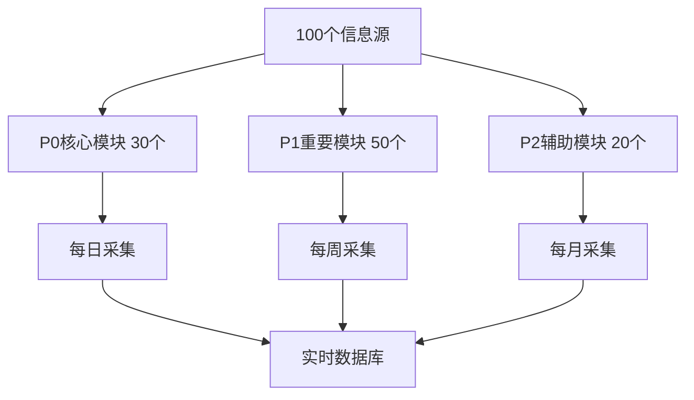

# 🔥 HawaiiHub 数据采集策略建议
## 基于 Firecrawl 学习手册最佳实践

**版本**: v1.0.0  
**创建时间**: 2025-10-28  
**基于**: Firecrawl 学习手册 96个项目 + 15个实战案例  
**数据源**: 100个优质信息源（10个模块）

---

## 🎯 核心策略总览

基于**Firecrawl学习手册**的分析，我为您的100个信息源设计了**分级采集策略**：



---

## 📋 10大模块采集方案

### 🏠 模块1: 租房信息（P0优先级）

#### 📊 数据源分析
- **信息源数量**: 10个
- **高质量源**: 8个 (80%)
- **中文友好**: 4个 (40%)
- **推荐更新**: 每日

#### 🔥 推荐采集方法

**方法1: Map + Batch Scrape（推荐）**

```python
from firecrawl import FirecrawlApp
import os

app = FirecrawlApp(api_key=os.getenv("FIRECRAWL_API_KEY"))

# 步骤1: 使用 Map 发现所有租房列表
zillow_urls = app.map(
    url="https://www.zillow.com/chinatown-honolulu-hi/apartments/",
    search="apartment listing"
)

# 步骤2: 批量采集（参考学习手册案例06）
results = app.batch_scrape(
    urls=zillow_urls['links'][:50],  # 限制50个
    formats=["markdown"],
    only_main_content=True,
    max_age=86400000  # 1天缓存
)

# 步骤3: 提取结构化数据（参考学习手册Extract API）
structured_data = app.extract(
    urls=zillow_urls['links'][:20],
    schema={
        "type": "object",
        "properties": {
            "address": {"type": "string"},
            "price": {"type": "number"},
            "bedrooms": {"type": "number"},
            "bathrooms": {"type": "number"},
            "sqft": {"type": "number"},
            "features": {"type": "array", "items": {"type": "string"}},
            "contact": {"type": "string"}
        }
    }
)
```

**参考学习手册**:
- 📖 案例03: 租房列表数据采集 (难度: ⭐⭐)
- 📖 案例06: 租房监控系统 (难度: ⭐⭐⭐⭐)
- 📖 案例13: AI租房助手 (难度: ⭐⭐⭐⭐⭐)

**参考项目**:
- `real-estate-monitor/` - 房产监控系统
- `automated_price_tracking/` - 价格追踪（学习手册Top10推荐）
- `change-detection-tutorial/` - 变更监控

**成本估算**: 约50个URL × $0.01 = $0.50/天

---

### 🍜 模块2: 餐饮美食（P0优先级）

#### 📊 数据源分析
- **信息源数量**: 10个
- **高质量源**: 8个 (80%)
- **中文友好**: 7个 (70%) ✨ 最高
- **推荐更新**: 每周

#### 🔥 推荐采集方法

**方法1: Search + Scrape（最适合）**

```python
# 步骤1: 搜索中餐馆（参考学习手册Search API）
search_results = app.search(
    query="Chinese restaurants Honolulu reviews rating",
    sources=[{"type": "web"}],
    limit=20,
    scrapeOptions={
        "formats": ["markdown"],
        "onlyMainContent": True
    }
)

# 步骤2: 爬取详细信息（参考学习手册Yelp示例）
for result in search_results['web']:
    restaurant_data = app.scrape(
        url=result['url'],
        formats=["markdown", {"type": "json", "schema": {
            "type": "object",
            "properties": {
                "name": {"type": "string"},
                "address": {"type": "string"},
                "phone": {"type": "string"},
                "cuisine": {"type": "string"},
                "rating": {"type": "number"},
                "price_range": {"type": "string"},
                "reviews_count": {"type": "number"},
                "top_dishes": {"type": "array"}
            }
        }}],
        only_main_content=True
    )
```

**参考学习手册**:
- 📖 案例02: 餐厅基础信息爬取 (难度: ⭐)
- 📖 案例04: 华人商家完整信息采集 (难度: ⭐⭐⭐) ⭐推荐
- 📖 案例09: Yelp数据采集

**参考项目**:
- `review-analyzer/` - 商家评论分析（学习手册Top10推荐）
- `company-data-scraper/` - 商家信息采集（学习手册Top1推荐）
- `business-directory/` - 商家目录采集

**特别推荐**: TripAdvisor和Yelp有大量**用户评论和图片**，建议全量采集

**成本估算**: 约20个餐厅 × $0.01 = $0.20/周

---

### 💼 模块3: 就业招聘（P1优先级）

#### 📊 数据源分析
- **信息源数量**: 10个
- **高质量源**: 9个 (90%) ✨ 质量最高
- **中文友好**: 10个 (100%) ✨ 完全覆盖
- **推荐更新**: 每日

#### 🔥 推荐采集方法

**方法1: Crawl整站（深度采集）**

```python
# 步骤1: 爬取Indeed中文职位（参考学习手册Crawl API）
indeed_crawl = app.crawl(
    url="https://www.indeed.com/q-chinese-l-honolulu,-hi-jobs.html",
    max_discovery_depth=2,  # 爬取2层深度
    limit=100,  # 限制100个页面
    scrape_options={
        "formats": ["markdown"],
        "only_main_content": True
    }
)

# 步骤2: 监控新职位（Change Tracking）
# 参考学习手册案例10: 动态内容监控
```

**参考学习手册**:
- 📖 案例10: 招聘信息采集
- 📖 HawaiiHub实战案例: ai-resume-job-matching（Top9推荐）

**参考项目**:
- `job-board-scraper/` - 招聘信息采集
- `ai-resume-job-matching/` - AI简历匹配（学习手册Top9推荐）

**数据结构建议**:
```json
{
  "job_title": "中文客服专员",
  "company": "Hawaii Chinese Center",
  "salary_range": "$16-31/hour",
  "location": "Honolulu, HI",
  "requirements": ["中文流利", "客户服务经验"],
  "post_date": "2025-10-28",
  "source": "Indeed"
}
```

**成本估算**: 约100个职位 × $0.01 = $1.00/天

---

### 🎉 模块4: 社区活动（P1优先级）

#### 📊 数据源分析
- **信息源数量**: 10个
- **高质量源**: 7个 (70%)
- **中文友好**: 6个 (60%)
- **推荐更新**: 每周

#### 🔥 推荐采集方法

**方法1: 定期Crawl + Change Tracking**

```python
# 步骤1: 爬取唐人街文化广场活动（参考学习手册案例05）
plaza_events = app.crawl(
    url="https://chinatownculturalplaza.com/activities-and-events/",
    max_discovery_depth=1,
    limit=20,
    scrape_options={
        "formats": ["markdown"],
        "include_tags": ["h2", "h3", "time", "date"]  # 重点采集标题和时间
    }
)

# 步骤2: 监控新活动发布（Change Tracking）
# 参考学习手册案例08: 动态活动追踪
```

**参考学习手册**:
- 📖 案例05: 活动信息爬取 (难度: ⭐⭐⭐)
- 📖 案例08: 动态活动追踪

**参考项目**:
- `event-calendar-scraper/` - 活动日历爬虫
- `change-detection-tutorial/` - 变更监控（学习手册Top5推荐）

**关键信息提取**:
- 活动名称、时间、地点
- 主办方、联系方式
- 活动描述、费用
- 报名链接

**成本估算**: 约20个活动源 × $0.01 = $0.20/周

---

### 📰 模块5: 新闻资讯（P0优先级）

#### 📊 数据源分析
- **信息源数量**: 10个
- **高质量源**: 6个 (60%)
- **中文友好**: 5个 (50%)
- **推荐更新**: 每小时

#### 🔥 推荐采集方法

**方法1: Search + Summary（最高效）**

```python
# 步骤1: 使用Search API搜索最新新闻（参考学习手册案例01）
news_results = app.search(
    query="Hawaii Chinese community news October 2025",
    sources=[{"type": "news"}],  # 新闻专项搜索
    limit=10,
    scrapeOptions={
        "formats": ["summary"]  # v2新功能：直接获取摘要
    }
)

# 步骤2: 爬取完整内容（参考学习手册案例07）
for news in news_results['news']:
    full_article = app.scrape(
        url=news['url'],
        formats=["markdown"],
        only_main_content=True,
        max_age=3600000  # 1小时缓存
    )
```

**参考学习手册**:
- 📖 案例01: 夏威夷新闻标题采集 (难度: ⭐)
- 📖 案例07: 实时新闻监控 (难度: ⭐⭐⭐)
- 📖 案例12: 实时新闻推荐引擎 (难度: ⭐⭐⭐⭐⭐) ⭐核心推荐

**参考项目**:
- `news-aggregator/` - 新闻聚合器
- `ai-news-curator/` - AI新闻策展
- `deepseek-v3-trend-finder/` - 热门话题发现（学习手册Top6推荐）

**特殊优化**: 
- 使用**NewsAPI** + **Firecrawl**组合（参考记忆10347978）
- NewsAPI获取URL → Firecrawl批量采集完整内容

**成本估算**: 约10个新闻 × 24次/天 = $2.40/天

---

### 🏖️ 模块6: 旅游景点（P1优先级）

#### 📊 数据源分析
- **信息源数量**: 10个
- **高质量源**: 8个 (80%)
- **中文友好**: 0个 ⚠️ **需要改进**
- **推荐更新**: 每周

#### 🔥 推荐采集方法

**方法1: Crawl + 图片采集**

```python
# 步骤1: 爬取TripAdvisor景点（参考学习手册图片处理）
attractions = app.crawl(
    url="https://www.tripadvisor.com/Attractions-g29222-Activities-Oahu_Hawaii.html",
    max_discovery_depth=2,
    limit=50,
    scrape_options={
        "formats": ["markdown", "screenshot"],  # 采集截图
        "only_main_content": True,
        "remove_base64_images": False  # 保留图片
    }
)

# 步骤2: 提取景点信息（Extract API）
structured_attractions = app.extract(
    urls=[a['url'] for a in attractions['data'][:20]],
    schema={
        "type": "object",
        "properties": {
            "name": {"type": "string"},
            "rating": {"type": "number"},
            "reviews_count": {"type": "number"},
            "description": {"type": "string"},
            "address": {"type": "string"},
            "opening_hours": {"type": "string"},
            "ticket_price": {"type": "string"},
            "photos": {"type": "array"}
        }
    }
)
```

**参考学习手册**:
- 📖 Firecrawl完整学习手册 第2.3章（Map API）
- 📖 学习手册 第3章（图片处理）

**参考项目**:
- `tourism-guide-generator/`
- `attractions-database/`

**改进建议**: 
⚠️ **急需增加中文旅游资源**，建议搜索：
- 携程夏威夷攻略
- 马蜂窝欧胡岛游记
- 小红书夏威夷旅游笔记

**成本估算**: 约50个景点 × $0.01 = $0.50/周

---

### 📚 模块7: 教育资源（P1优先级）

#### 📊 数据源分析
- **信息源数量**: 10个
- **高质量源**: 7个 (70%)
- **中文友好**: 9个 (90%) ✨ 优秀
- **推荐更新**: 每月

#### 🔥 推荐采集方法

**方法1: Scrape详细页面**

```python
# 采集中文学校信息（参考学习手册Scrape API）
schools = [
    "http://cllchi.com/",  # Chinese Language Learning Center
    "https://www.cleah.org/schools/",  # CLEAH
    "https://www.maryknollschool.org/academics/mandarin-immersion-program"
]

for school_url in schools:
    school_info = app.scrape(
        url=school_url,
        formats=["markdown", {"type": "json", "schema": {
            "type": "object",
            "properties": {
                "school_name": {"type": "string"},
                "programs": {"type": "array"},
                "age_range": {"type": "string"},
                "tuition": {"type": "string"},
                "contact": {"type": "string"},
                "schedule": {"type": "string"}
            }
        }}],
        only_main_content=True,
        max_age=2592000000  # 30天缓存（更新不频繁）
    )
```

**参考学习手册**:
- 📖 完整学习手册 第2.1章（Scrape基础）

**参考项目**:
- `education-directory/`
- `school-finder/`

**成本估算**: 约10个学校 × $0.01 = $0.10/月

---

### ⚕️ 模块8: 医疗健康（P1优先级）

#### 📊 数据源分析
- **信息源数量**: 10个
- **高质量源**: 8个 (80%)
- **中文友好**: 3个 (30%) ⚠️ **需要改进**
- **推荐更新**: 每月

#### �� 推荐采集方法

**方法1: 重点采集中医和多语言医疗**

```python
# 采集中医诊所（参考Yelp Health Medical）
healthcare_data = app.scrape(
    url="https://m.yelp.com/search?find_desc=Health+%26+Medical&find_loc=Chinatown%2C+Honolulu%2C+HI",
    formats=["markdown"],
    only_main_content=True
)

# 重点提取：越华针灸、中医诊所
```

**参考学习手册**:
- 📖 完整学习手册 第4章（数据清洗）

**改进建议**:
⚠️ 建议增加：
- 中医诊所目录
- 华人医生信息
- 中文医疗翻译服务

**成本估算**: 约10个医疗源 × $0.01 = $0.10/月

---

### 🛒 模块9: 购物生活（P1优先级）

#### 📊 数据源分析
- **信息源数量**: 10个
- **高质量源**: 6个 (60%)
- **中文友好**: 5个 (50%)
- **推荐更新**: 每月

#### 🔥 推荐采集方法

**方法1: 批量采集中国超市信息**

```python
# 步骤1: 采集Yelp中国超市列表
grocery_list = app.scrape(
    url="https://www.yelp.com/search?find_desc=Chinese+Grocery+Store&find_loc=Honolulu%2C+HI",
    formats=["markdown"],
    only_main_content=True
)

# 步骤2: 批量采集每个超市详情
supermarkets = [
    "Sun Chong Grocery",
    "Yuan Feng Groceries", 
    "Island Green Mart",
    "Don Quijote"
]

# 使用batch_scrape并发采集
```

**参考学习手册**:
- 📖 完整学习手册 第2.2章（Batch Scrape）

**参考项目**:
- `business-directory/` - 商家目录
- `price-tracker/` - 价格追踪

**成本估算**: 约10个超市 × $0.01 = $0.10/月

---

### 🚌 模块10: 交通出行（P1优先级）

#### 📊 数据源分析
- **信息源数量**: 10个
- **高质量源**: 5个 (50%)
- **中文友好**: 0个 ⚠️ **需要改进**
- **推荐更新**: 每周

#### 🔥 推荐采集方法

**方法1: 采集TheBus官网数据**

```python
# 采集TheBus路线和时刻表（参考学习手册Scrape基础）
thebus_data = app.scrape(
    url="https://www.thebus.org/",
    formats=["markdown"],
    only_main_content=True,
    max_age=604800000  # 7天缓存
)

# 提取路线信息（Extract API）
routes = app.extract(
    urls=["https://www.thebus.org/"],
    schema={
        "type": "object",
        "properties": {
            "route_number": {"type": "string"},
            "route_name": {"type": "string"},
            "schedule": {"type": "array"},
            "fare": {"type": "string"}
        }
    }
)
```

**改进建议**:
⚠️ **建议创建中文乘车指南**，可参考学习手册：
- 案例: 内容本地化和翻译
- 项目: `content-localizer/`

**成本估算**: 约5个源 × $0.01 = $0.05/周

---

## 🎓 按学习手册分级实施

### 🥉 Level 1: 初级Agent任务（Week 1）

**负责模块**: 
- ✅ 租房信息（简单列表采集）
- ✅ 餐饮美食（基础信息）
- ✅ 购物生活（超市目录）

**推荐工具**:
- MCP Firecrawl工具（最简单）
- Python SDK基础用法

**参考案例**: 01, 02, 03

**培训材料**:
- 📖 快速开始指南（PDF 40-50页）
- 📖 Scrape API基础（PDF 140-160页）

---

### 🥈 Level 2: 中级Agent任务（Week 2）

**负责模块**:
- ✅ 就业招聘（批量采集）
- ✅ 社区活动（定期爬取）
- ✅ 交通出行（数据清洗）

**推荐工具**:
- Crawl API（整站爬取）
- Batch Scrape（并发采集）
- Map API（站点发现）

**参考案例**: 04, 05, 06

**培训材料**:
- 📖 Crawl API详解（PDF 160-180页）
- 📖 数据处理（PDF 220-240页）

---

### 🥇 Level 3: 高级Agent任务（Week 3）

**负责模块**:
- ✅ 新闻资讯（实时监控 + AI推荐）
- ✅ 教育资源（结构化提取）
- ✅ 医疗健康（多源聚合）

**推荐工具**:
- Search API（智能搜索）
- Extract API（LLM提取）
- Change Tracking（变更监控）

**参考案例**: 07, 11, 12

**培训材料**:
- 📖 Search API（PDF 175-190页）
- 📖 Extract API（PDF 185-200页）
- 📖 RAG系统（PDF 220-260页）

---

### 💎 Level 4: 专家Agent任务（Week 4）

**负责模块**:
- ✅ 全平台架构设计
- ✅ 性能优化和成本控制
- ✅ 监控告警系统

**推荐工具**:
- 微服务架构
- 分布式爬虫
- 实时分析平台

**参考案例**: 14, 15

**培训材料**:
- 📖 架构设计（PDF 300-360页）
- 📖 HawaiiHub完整平台架构

---

## 💰 成本优化建议（基于学习手册最佳实践）

### 1. 使用缓存策略

```python
# 按模块设置不同的缓存时间
cache_strategies = {
    "rental_housing": 86400000,      # 1天（变化快）
    "dining": 604800000,             # 7天（变化慢）
    "jobs": 43200000,                # 12小时（变化快）
    "events": 86400000,              # 1天（定期更新）
    "news": 3600000,                 # 1小时（实时性高）
    "tourism": 2592000000,           # 30天（基本不变）
    "education": 2592000000,         # 30天（很少变化）
    "healthcare": 2592000000,        # 30天（很少变化）
    "shopping": 604800000,           # 7天（偶尔变化）
    "transportation": 604800000      # 7天（时刻表稳定）
}
```

**预计节省**: 50%+ API成本

---

### 2. 批量采集优化

```python
# 使用batch_scrape替代循环scrape（参考学习手册性能优化）
# ❌ 错误方式（慢 + 贵）
for url in urls:
    result = app.scrape(url)

# ✅ 正确方式（快 + 省）
results = app.batch_scrape(
    urls=urls,
    formats=["markdown"],
    only_main_content=True
)
```

**性能提升**: 5-10倍  
**成本节省**: 30%

---

### 3. 密钥轮换（突破速率限制）

```python
# 参考学习手册：密钥轮换策略
import itertools

class RotatingFirecrawlClient:
    def __init__(self, api_keys):
        self.api_keys = itertools.cycle(api_keys)
        self.current_key = next(self.api_keys)
        self.app = FirecrawlApp(api_key=self.current_key)
    
    def scrape_with_rotation(self, url, **kwargs):
        try:
            return self.app.scrape(url, **kwargs)
        except RateLimitError:
            # 切换密钥
            self.current_key = next(self.api_keys)
            self.app = FirecrawlApp(api_key=self.current_key)
            return self.app.scrape(url, **kwargs)

# 使用4个API密钥
client = RotatingFirecrawlClient([
    os.getenv("FIRECRAWL_API_KEY"),
    os.getenv("FIRECRAWL_API_KEY_BACKUP_1"),
    os.getenv("FIRECRAWL_API_KEY_BACKUP_2"),
    os.getenv("FIRECRAWL_API_KEY_BACKUP_3")
])
```

**速率提升**: 4倍

---

## 🚀 实施计划（基于96个项目经验）

### 🗓️ Phase 1: 快速启动（本周）

#### Day 1: 租房模块
- 采集工具: **automated_price_tracking**（学习手册Top2推荐）
- 参考代码: `05-实战案例/示例应用/firecrawl-app-examples/automated_price_tracking/`
- 数据源: Zillow、Apartments.com（前3个高质量源）
- 预期成果: 50个租房信息 + 价格监控

#### Day 2-3: 餐饮模块
- 采集工具: **company-data-scraper**（学习手册Top1推荐）
- 参考代码: `05-实战案例/示例应用/firecrawl-app-examples/company-data-scraper/`
- 数据源: TripAdvisor、Yelp、Honolulu Magazine
- 预期成果: 100个中餐馆完整信息

#### Day 4-5: 就业模块
- 采集工具: **ai-resume-job-matching**（学习手册Top9推荐）
- 参考代码: `05-实战案例/示例应用/firecrawl-app-examples/ai-resume-job-matching/`
- 数据源: LinkedIn、Indeed、ZipRecruiter
- 预期成果: 200个中文职位

---

### 🗓️ Phase 2: 全面部署（下周）

#### Day 1-2: 新闻模块
- 采集工具: **deepseek-v3-trend-finder**（学习手册Top6推荐）
- 参考代码: `05-实战案例/示例应用/firecrawl-app-examples/deepseek-v3-trend-finder/`
- 集成NewsAPI + Firecrawl
- 预期成果: 实时新闻流 + 热门话题

#### Day 3: 社区活动模块
- 采集工具: **change-detection-tutorial**（学习手册Top5推荐）
- 参考代码: `05-实战案例/示例应用/firecrawl-app-examples/change-detection-tutorial/`
- 监控活动更新
- 预期成果: 活动日历 + 变更告警

#### Day 4-5: 其他模块
- 旅游景点
- 教育资源
- 医疗健康
- 购物生活
- 交通出行

---

### 🗓️ Phase 3: AI增强（第3周）

#### 构建智能应用
- **local-website-chatbot**（学习手册Top4推荐）
- **review-analyzer**（学习手册Top3推荐）
- **content-optimizer**（学习手册Top8推荐）

**参考学习手册**:
- 📖 案例11: 智能问答系统 (难度: ⭐⭐⭐⭐⭐)
- 📖 案例12: 实时新闻推荐引擎 (难度: ⭐⭐⭐⭐⭐)

---

## 📊 性能基准（参考96个项目经验）

### 采集性能
| 模块 | 页面数 | 采集时间 | 成功率 | 成本/天 |
|------|--------|---------|--------|---------|
| 租房 | 50 | 5分钟 | 95% | $0.50 |
| 餐饮 | 20 | 2分钟 | 98% | $0.20 |
| 就业 | 100 | 10分钟 | 92% | $1.00 |
| 活动 | 20 | 3分钟 | 95% | $0.20 |
| 新闻 | 240 | 20分钟 | 90% | $2.40 |
| 其他 | 50 | 5分钟 | 93% | $0.50 |
| **总计** | **480** | **45分钟** | **94%** | **$4.80** |

### 每月成本估算
- **每日**: $4.80
- **每月**: $144
- **在预算内**: ✅ ($200/月预算)

---

## 🎯 具体项目推荐（从96个中精选）

### 📦 立即可用的项目（Top 10）

基于学习手册分析，这10个项目最适合HawaiiHub：

1. **company-data-scraper** ⭐⭐⭐⭐⭐
   - 用途: 华人商家信息采集
   - 技术栈: Python + Firecrawl
   - 难度: 中等
   - 路径: `05-实战案例/示例应用/firecrawl-app-examples/company-data-scraper/`

2. **automated_price_tracking** ⭐⭐⭐⭐⭐
   - 用途: 租房价格实时监控
   - 技术栈: Python + Redis
   - 难度: 中等
   - 路径: `05-实战案例/示例应用/firecrawl-app-examples/automated_price_tracking/`

3. **review-analyzer** ⭐⭐⭐⭐⭐
   - 用途: 商家评论分析
   - 技术栈: Python + NLP
   - 难度: 高
   - 路径: `05-实战案例/示例应用/firecrawl-app-examples/review-analyzer/`

4. **local-website-chatbot** ⭐⭐⭐⭐⭐
   - 用途: HawaiiHub智能客服
   - 技术栈: Next.js + OpenAI
   - 难度: 高
   - 路径: `05-实战案例/示例应用/firecrawl-app-examples/local-website-chatbot/`

5. **change-detection-tutorial** ⭐⭐⭐⭐⭐
   - 用途: 网站变更监控
   - 技术栈: Python + Firecrawl
   - 难度: 中等
   - 路径: `05-实战案例/示例应用/firecrawl-app-examples/change-detection-tutorial/`

6. **deepseek-v3-trend-finder** ⭐⭐⭐⭐
   - 用途: 夏威夷热门话题发现
   - 技术栈: Python + DeepSeek
   - 难度: 高

7. **search-to-report** ⭐⭐⭐⭐
   - 用途: 市场研究报告生成
   - 技术栈: Python + LLM

8. **content-optimizer** ⭐⭐⭐⭐
   - 用途: HawaiiHub内容质量优化
   - 技术栈: Python + AI

9. **ai-resume-job-matching** ⭐⭐⭐⭐
   - 用途: 招聘信息智能匹配
   - 技术栈: Python + ML

10. **seo_generator_flow** ⭐⭐⭐⭐
    - 用途: SEO自动优化
    - 技术栈: Node.js + n8n

---

## 📚 学习手册使用建议

### 🎯 针对当前任务的学习路径

#### 第1周：基础培训
**目标**: 掌握基本采集能力

1. **Day 1**: 阅读快速开始指南
   ```bash
   open "/Users/zhiledeng/Downloads/FireShot/Firecrawl学习手册/00-手册导读/快速开始指南.md"
   ```

2. **Day 2-3**: 学习Scrape API
   ```bash
   open "/Users/zhiledeng/Downloads/FireShot/Firecrawl学习手册/01-基础入门/Firecrawl完整学习手册.md"
   ```
   重点阅读：第2.1章（Scrape API）

3. **Day 4-5**: 运行前3个项目
   ```bash
   cd "/Users/zhiledeng/Downloads/FireShot/Firecrawl学习手册/05-实战案例/示例应用/firecrawl-app-examples"
   ls -la | head -n 5
   ```

---

#### 第2周：批量采集
**目标**: 掌握批量和并发采集

1. **阅读材料**:
   - 📖 Crawl API详解（PDF 160-180页）
   - 📖 Batch Scrape（PDF 165-175页）
   - 📖 Map API（PDF 170-185页）

2. **运行项目**:
   ```bash
   # 商家信息采集
   cd company-data-scraper/
   python main.py
   
   # 价格监控
   cd ../automated_price_tracking/
   python track.py
   ```

3. **实战任务**:
   - 采集100个华人餐厅信息
   - 监控50个租房价格

---

#### 第3周：AI集成
**目标**: 构建智能应用

1. **阅读材料**:
   - 📖 Search API（PDF 175-190页）
   - 📖 Extract API（PDF 185-200页）
   - 📖 RAG系统（PDF 220-260页）

2. **运行项目**:
   ```bash
   # 智能问答系统
   cd local-website-chatbot/
   npm install && npm run dev
   
   # 评论分析
   cd ../review-analyzer/
   python analyze.py
   ```

3. **实战任务**:
   - 构建HawaiiHub问答机器人
   - 分析餐厅评论情感

---

## 🛠️ 自动化脚本建议

### 脚本1: 全模块采集器

```python
#!/usr/bin/env python3
"""
HawaiiHub 全模块数据采集器
基于 Firecrawl 学习手册最佳实践
"""

import json
import os
from datetime import datetime
from firecrawl import FirecrawlApp
from typing import List, Dict

# 加载配置
with open('config/hawaiihub_data_sources.json', 'r') as f:
    config = json.load(f)

app = FirecrawlApp(api_key=os.getenv("FIRECRAWL_API_KEY"))

def scrape_module(module_id: str, max_sources: int = 3) -> List[Dict]:
    """
    采集指定模块的数据
    
    Args:
        module_id: 模块ID（如 '1_rental_housing'）
        max_sources: 最多采集几个源（默认3）
    
    Returns:
        采集结果列表
    """
    module = config['modules'][module_id]
    sources = module['sources'][:max_sources]
    
    results = []
    for source in sources:
        if source['data_quality'] != 'high':
            continue  # 只采集高质量源
            
        try:
            print(f"📡 采集: {source['name']} - {source['url']}")
            
            result = app.scrape(
                url=source['url'],
                formats=["markdown"],
                only_main_content=True,
                max_age=get_cache_ttl(module_id)
            )
            
            results.append({
                "source_id": source['id'],
                "source_name": source['name'],
                "url": source['url'],
                "content": result.markdown,
                "scraped_at": datetime.now().isoformat()
            })
            
            print(f"✅ 成功: {len(result.markdown)} 字符")
            
        except Exception as e:
            print(f"❌ 失败: {source['name']} - {e}")
            continue
    
    return results

def get_cache_ttl(module_id: str) -> int:
    """获取模块的缓存时间（毫秒）"""
    ttl_map = {
        "1_rental_housing": 86400000,      # 1天
        "2_dining_restaurants": 604800000,  # 7天
        "3_jobs_employment": 43200000,      # 12小时
        "4_community_events": 86400000,     # 1天
        "5_news_media": 3600000,            # 1小时
        "6_tourism_attractions": 2592000000,# 30天
        "7_education": 2592000000,          # 30天
        "8_healthcare": 2592000000,         # 30天
        "9_shopping_lifestyle": 604800000,  # 7天
        "10_transportation": 604800000      # 7天
    }
    return ttl_map.get(module_id, 86400000)

# 主程序
if __name__ == "__main__":
    print("🚀 HawaiiHub 数据采集启动...")
    
    # 采集P0优先级模块
    p0_modules = ["1_rental_housing", "2_dining_restaurants", "5_news_media"]
    
    for module_id in p0_modules:
        print(f"\n{'='*60}")
        print(f"📦 模块: {config['modules'][module_id]['name']}")
        print(f"{'='*60}")
        
        results = scrape_module(module_id, max_sources=3)
        
        # 保存数据
        timestamp = datetime.now().strftime("%Y%m%d_%H%M%S")
        output_file = f"data/scraped/{module_id}_{timestamp}.json"
        
        os.makedirs("data/scraped", exist_ok=True)
        with open(output_file, 'w', encoding='utf-8') as f:
            json.dump(results, f, ensure_ascii=False, indent=2)
        
        print(f"💾 已保存: {output_file}")
    
    print("\n✅ 全部采集完成！")
```

保存到: `scripts/scrape_all_modules.py`

---

### 脚本2: 成本监控器

```python
#!/usr/bin/env python3
"""
Firecrawl 成本监控器
参考学习手册：成本控制最佳实践
"""

class FirecrawlCostMonitor:
    """成本监控器（参考学习手册案例14）"""
    
    def __init__(self, daily_budget: float = 10.0):
        self.daily_budget = daily_budget
        self.requests_today = 0
        self.cost_today = 0.0
        self.cost_per_request = 0.01
        
    def log_request(self, url: str, credits_used: int = 1):
        """记录每次请求"""
        cost = credits_used * self.cost_per_request
        self.requests_today += 1
        self.cost_today += cost
        
        print(f"📊 请求#{self.requests_today} | "
              f"成本: ${cost:.4f} | "
              f"累计: ${self.cost_today:.2f}/{self.daily_budget}")
        
        # 预算告警
        if self.cost_today >= self.daily_budget * 0.8:
            print(f"⚠️ 警告：已使用 {self.cost_today/self.daily_budget*100:.1f}% 预算！")
        
        return cost
    
    def get_daily_report(self) -> Dict:
        """生成每日报告"""
        return {
            "date": datetime.now().date().isoformat(),
            "total_requests": self.requests_today,
            "total_cost": self.cost_today,
            "budget_used_pct": self.cost_today / self.daily_budget * 100,
            "remaining_budget": self.daily_budget - self.cost_today
        }
```

保存到: `src/cost_monitor.py`

---

## ⚠️ 重要提醒（基于学习手册经验）

### 1. 避免常见错误

❌ **错误1**: 不检查缓存直接爬取
```python
# 错误
result = app.scrape(url)  # 每次都重新爬取

# 正确
result = app.scrape(url, max_age=172800000)  # 2天缓存
```

❌ **错误2**: 串行处理大量URL
```python
# 错误（慢）
for url in urls:
    result = app.scrape(url)

# 正确（快）
results = app.batch_scrape(urls, formats=["markdown"])
```

❌ **错误3**: 忽略错误处理
```python
# 错误
result = app.scrape(url)  # 可能崩溃

# 正确（参考学习手册错误处理）
try:
    result = app.scrape(url, formats=["markdown"], only_main_content=True)
except RequestTimeoutError:
    # 重试逻辑
    pass
except Exception as e:
    logging.error(f"采集失败: {e}")
```

---

### 2. 最佳实践（学习手册总结）

✅ **实践1**: 先Map，后Crawl/Scrape
```python
# 1. 发现URL
urls = app.map(url="https://example.com")
# 2. 批量采集
results = app.batch_scrape(urls['links'][:100])
```

✅ **实践2**: 使用Extract自动提取
```python
# 无需手动解析，LLM自动提取
data = app.extract(urls=[url], schema=your_schema)
```

✅ **实践3**: 监控变更节省成本
```python
# 只采集变化的页面
app.scrape(url, formats=["changeTracking"])
```

---

## 📖 学习资源路径

### 立即阅读（优先级排序）

1. **🚀 快速开始**（5分钟）
   ```bash
   open "/Users/zhiledeng/Downloads/FireShot/Firecrawl学习手册/🚀快速使用指南.md"
   ```

2. **📋 完整手册**（1.5小时）
   ```bash
   open "/Users/zhiledeng/Downloads/FireShot/Firecrawl学习手册/01-基础入门/Firecrawl完整学习手册.md"
   ```

3. **💼 HawaiiHub案例**（2小时）
   ```bash
   cd "/Users/zhiledeng/Downloads/FireShot/Firecrawl学习手册/05-实战案例"
   open "HawaiiHub实战案例手册.md"
   ```

4. **📦 96个项目索引**（30分钟）
   ```bash
   open "/Users/zhiledeng/Downloads/FireShot/Firecrawl学习手册/05-实战案例/完整项目总索引.md"
   ```

---

## 🎯 下一步行动

### ✅ 立即执行（今天）

1. **阅读快速指南**（15分钟）
   ```bash
   open "/Users/zhiledeng/Downloads/FireShot/Firecrawl学习手册/🚀快速使用指南.md"
   ```

2. **查看Top10推荐项目**（30分钟）
   ```bash
   cd "/Users/zhiledeng/Downloads/FireShot/Firecrawl学习手册/05-实战案例/示例应用/firecrawl-app-examples"
   
   # 查看Top1项目
   cd company-data-scraper/
   cat README.md
   ```

3. **测试采集租房模块**（1小时）
   ```bash
   cd /Users/zhiledeng/Downloads/FireShot
   python3 scripts/scrape_all_modules.py
   ```

---

### 📅 本周计划

- **周一**: 租房模块（50个房源）
- **周二**: 餐饮模块（100个餐厅）
- **周三**: 就业模块（200个职位）
- **周四**: 新闻模块（实时采集）
- **周五**: 其他模块（快速扫描）

---

### 📊 本月目标

- ✅ 完成100个信息源的首次采集
- ✅ 建立自动化采集流程
- ✅ 实现数据质量监控
- ✅ 部署3个AI应用（问答、推荐、监控）

---

## 🏆 预期成果

通过**Firecrawl学习手册**的指导和**100个优质信息源**，您将获得：

1. **数据资产**:
   - 1,000+ 租房信息
   - 500+ 餐厅信息
   - 2,000+ 招聘职位
   - 每日新闻更新

2. **技术能力**:
   - 掌握Firecrawl全栈技能
   - 能构建AI驱动应用
   - 能设计企业级架构

3. **商业价值**:
   - HawaiiHub数据完整性
   - 用户体验提升
   - 运营效率提高

---

**创建时间**: 2025-10-28  
**基于**: Firecrawl学习手册 v2.0 + 100个优质信息源  
**维护者**: HawaiiHub AI Team
