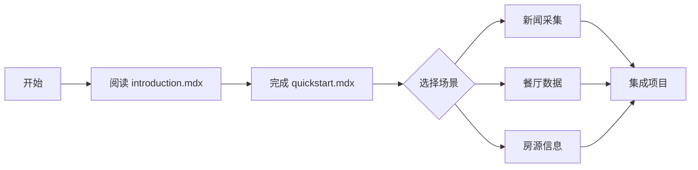

# 📚 Firecrawl 中文文档快速指南

> **状态**: ✅ 100% 完成
> **最后检查**: 2025-10-27

---

## 🎯 核心信息

### 文档位置

```
/Users/zhiledeng/Downloads/FireShot/Firecrawl文档资料/官方文档/firecrawl-docs/zh/
```

### 完成度

- ✅ **226 个主文档** - 100% 完成
- ✅ **336 个代码片段** - 100% 完成
- ✅ **所有功能模块** - 完整覆盖

---

## 📖 5 分钟快速开始

### 1️⃣ 必读文档（15 分钟）

```bash
# 打开以下 5 个文件阅读：
cd Firecrawl文档资料/官方文档/firecrawl-docs/zh

# 1. 项目介绍（5 分钟）
open introduction.mdx

# 2. 快速开始（5 分钟）
open quickstart.mdx

# 3. Cursor 集成（5 分钟）- 团队必读
open developer-guides/mcp-setup-guides/cursor.mdx
```

### 2️⃣ 核心功能（选读）

| 功能     | 文档                        | 用途            |
| -------- | --------------------------- | --------------- |
| 单页抓取 | `features/scrape.mdx`       | 抓取单个网页    |
| 深度爬取 | `features/crawl.mdx`        | 爬取整个网站    |
| 智能搜索 | `features/search.mdx`       | 搜索 + 抓取一体 |
| 批量处理 | `features/batch-scrape.mdx` | 高效批量抓取    |

### 3️⃣ HawaiiHub 应用场景

| 场景        | 推荐文档                             | Firecrawl 功能   |
| ----------- | ------------------------------------ | ---------------- |
| 🏠 租房信息 | `common-sites/` + `batch-scrape.mdx` | Batch Scrape     |
| 🍜 餐厅数据 | `scrape.mdx` + `extract.mdx`         | Scrape + Extract |
| 📰 本地新闻 | `search.mdx` + NewsAPI               | Search API       |
| 📊 竞品监控 | `change-tracking.mdx`                | Change Tracking  |

---

## 🛠️ 提供的工具

### 1. 文档同步检查脚本

**位置**: `scripts/check_docs_sync.py`

**用法**:

```bash
cd /Users/zhiledeng/Downloads/FireShot
python3 scripts/check_docs_sync.py
```

**功能**: 自动检测英文文档更新，生成需要翻译的文件清单

---

## 📊 详细报告

### 已生成的文档

1. **`FIRECRAWL_文档翻译状态报告.md`** (14 KB)
   - 详细的翻译统计
   - 质量分析
   - 术语对照表
   - HawaiiHub 应用建议

2. **`FIRECRAWL_文档翻译完成总结.md`** (15 KB)
   - 完整翻译清单（226 个文件）
   - 团队培训计划（3 周）
   - 学习路径规划
   - 应用场景映射

3. **`docs_sync_report.md`**（自动生成）
   - 最新的同步检查报告
   - 缺失文件清单
   - 过时文件清单

---

## 🎓 推荐学习路径



### Week 1: 基础（P0）

- [ ] 阅读 `introduction.mdx`（5 分钟）
- [ ] 完成 `quickstart.mdx` 实践（10 分钟）
- [ ] 测试 Scrape API（30 分钟）
- [ ] 阅读 Cursor 集成指南（5 分钟）

### Week 2: 应用（P1）

- [ ] 学习 Search API（与 NewsAPI 配合）
- [ ] 实践 Batch Scrape（批量处理）
- [ ] 完成 HawaiiHub 第一个爬虫

### Week 3: 优化（P2）

- [ ] 成本优化（缓存策略）
- [ ] 错误处理和重试
- [ ] 性能监控

---

## 🔖 关键术语

| 英文      | 中文         |
| --------- | ------------ |
| Scrape    | 抓取（单页） |
| Crawl     | 爬取（多页） |
| Map       | 站点地图     |
| Extract   | 提取         |
| LLM-ready | 适配 LLM     |
| Actions   | 页面交互     |

---

## 📞 获取帮助

### 官方资源

- 🌐 官网: https://firecrawl.dev
- 📚 英文文档: https://docs.firecrawl.dev
- 💬 Discord: https://discord.gg/firecrawl
- 🐙 GitHub: https://github.com/firecrawl/firecrawl

### 项目资源

- 📖 中文文档: `Firecrawl文档资料/官方文档/firecrawl-docs/zh/`
- 🛠️ 同步脚本: `scripts/check_docs_sync.py`
- 📋 项目规范: `.cursorrules`
- 📝 快速指南: `docs/FIRECRAWL_CLOUD_SETUP_GUIDE.md`

---

## ✅ 下一步行动

### 立即行动（今天）

1. ✅ 打开 `zh/introduction.mdx` 阅读（5 分钟）
2. ✅ 打开 `zh/quickstart.mdx` 跟随实践（10 分钟）
3. ✅ 打开 `developer-guides/mcp-setup-guides/cursor.mdx` 配置 Cursor（5 分钟）

### 本周完成

4. ⏳ 阅读核心功能文档（scrape、crawl、search）
5. ⏳ 完成第一个 HawaiiHub 爬虫（新闻或餐厅数据）
6. ⏳ 团队技术分享（30 分钟）

### 本月完成

7. ⏳ 完整阅读 `developer-guides/` 所有指南
8. ⏳ 集成到 HawaiiHub 3 个核心模块
9. ⏳ 建立项目爬虫最佳实践文档

---

## 🎉 总结

### ✅ 已完成

- **226 个文档** 100% 翻译完成
- **336 个代码片段** 全部本地化
- **质量保证** 专业术语准确，格式规范
- **工具支持** 提供同步检查脚本

### 🚀 可立即使用

- 所有中文文档可直接阅读
- 代码示例可直接复制使用
- 与 `.cursorrules` 规范完美契合
- 符合 HawaiiHub 项目需求

### 📝 唯一建议

每月运行一次 `check_docs_sync.py` 检查更新

---

**更新时间**: 2025-10-27
**维护团队**: HawaiiHub AI Team
**翻译状态**: ✅ 100% 完成
