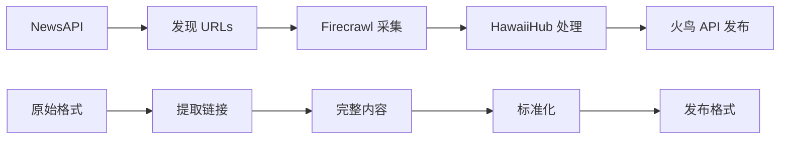

# 火鸟门户系统新闻 JSON 格式规范

**版本**: v1.0
**更新时间**: 2025-10-28
**维护者**: HawaiiHub AI Team

---

## 📋 目录

1. [火鸟 API 发布格式（输出）](#1-火鸟-api-发布格式输出)
2. [NewsAPI 采集格式（输入）](#2-newsapi-采集格式输入)
3. [HawaiiHub 内部格式（处理）](#3-hawaiihub-内部格式处理)
4. [Firecrawl 采集格式（原始）](#4-firecrawl-采集格式原始)
5. [格式转换映射关系](#5-格式转换映射关系)
6. [完整示例](#6-完整示例)
7. [字段详解](#7-字段详解)
8. [最佳实践](#8-最佳实践)

---

## 1. 火鸟 API 发布格式（输出）

### 🎯 用途
发布新闻到火鸟门户系统后台的 API 格式

### 📍 接口
```
POST https://hawaiihub.net/api.php?service=article&action=add
```

### 📝 请求格式

```json
{
  "title": "新闻标题",
  "description": "摘要/导语（可选）",
  "body": "正文内容（HTML 或纯文本）",
  "keywords": "关键词1,关键词2,关键词3",
  "source": "来源（如：Hawaii News Now）"
}
```

### 📋 字段说明

| 字段 | 类型 | 必填 | 长度限制 | 说明 |
|------|------|------|----------|------|
| `title` | String | ✅ 是 | 1-200 字符 | 新闻标题 |
| `description` | String | ⚠️ 推荐 | 0-500 字符 | 摘要/导语 |
| `body` | String | ✅ 是 | 100+ 字符 | 正文内容（支持 HTML） |
| `keywords` | String | ⚠️ 推荐 | 逗号分隔 | SEO 关键词 |
| `source` | String | ⚠️ 推荐 | 1-100 字符 | 新闻来源 |

### ✅ 响应格式

```json
{
  "state": 100,
  "info": "发布成功",
  "id": 12345
}
```

| 字段 | 说明 |
|------|------|
| `state` | 100=成功, 200=失败 |
| `info` | 提示信息 |
| `id` | 文章 ID（成功时返回） |

### 🔗 文章 URL
```
https://hawaiihub.net/news/{id}
```

---

## 2. NewsAPI 采集格式（输入）

### 🎯 用途
从 NewsAPI 获取夏威夷新闻的数据格式

### 📍 接口
```
GET https://newsapi.org/v2/everything?q=(Hawaii OR Honolulu)&apiKey={key}
```

### 📝 原始格式

```json
{
  "status": "ok",
  "totalResults": 100,
  "articles": [
    {
      "source": {
        "id": null,
        "name": "Hawaii News Now"
      },
      "author": "John Doe",
      "title": "Breaking: Hawaii Weather Alert",
      "description": "A severe weather warning has been issued...",
      "url": "https://hawaiinewsnow.com/article/123",
      "urlToImage": "https://hawaiinewsnow.com/images/123.jpg",
      "publishedAt": "2025-10-28T10:00:00Z",
      "content": "Full article content..."
    }
  ]
}
```

### 📋 字段说明

| 字段 | 类型 | 说明 |
|------|------|------|
| `source.name` | String | 新闻源名称 |
| `author` | String | 作者 |
| `title` | String | 标题 |
| `description` | String | 摘要 |
| `url` | String | 原文链接 |
| `urlToImage` | String | 封面图 URL |
| `publishedAt` | String | 发布时间（ISO 8601） |
| `content` | String | 内容片段（通常截断） |

### 🔄 n8n 工作流处理后格式

```json
{
  "id": "newsapi-1730102400000-0",
  "title": "Breaking: Hawaii Weather Alert",
  "description": "A severe weather warning has been issued...",
  "url": "https://hawaiinewsnow.com/article/123",
  "source": "Hawaii News Now",
  "publishedAt": "2025-10-28T10:00:00Z",
  "author": "John Doe",
  "urlToImage": "https://hawaiinewsnow.com/images/123.jpg",
  "scrapedAt": "2025-10-28T10:30:00.000Z"
}
```

---

## 3. HawaiiHub 内部格式（处理）

### 🎯 用途
HawaiiHub 新闻采集系统内部使用的标准格式

### 📝 数据结构

#### 3.1 单篇文章格式

```json
{
  "url": "https://hawaiinewsnow.com/article/123",
  "metadata": {
    "source_url": "https://hawaiinewsnow.com/article/123",
    "title": "Breaking: Hawaii Weather Alert",
    "description": "A severe weather warning has been issued...",
    "status_code": 200,
    "cache_state": "HIT"
  },
  "content": {
    "markdown": "# Breaking: Hawaii Weather Alert\n\nA severe weather warning...",
    "html": "<h1>Breaking: Hawaii Weather Alert</h1>...",
    "links": [
      "https://example.com/related-1",
      "https://example.com/related-2"
    ]
  },
  "scraped_at": "2025-10-28T10:30:00.123Z",
  "attempt": 1
}
```

#### 3.2 新闻源采集结果格式

```json
{
  "source_id": "hawaii-news-now",
  "source_name": "Hawaii News Now",
  "source_url": "https://www.hawaiinewsnow.com/",
  "status": "success",
  "homepage": {
    "url": "https://www.hawaiinewsnow.com/",
    "metadata": { ... },
    "content": { ... },
    "scraped_at": "2025-10-28T10:00:00.000Z"
  },
  "articles": [
    {
      "url": "https://hawaiinewsnow.com/article/1",
      "metadata": { ... },
      "content": { ... },
      "scraped_at": "2025-10-28T10:30:00.000Z"
    }
  ],
  "stats": {
    "total_articles": 15,
    "duration_seconds": 45.2,
    "articles_per_minute": 19.9
  },
  "scraped_at": "2025-10-28T10:45:00.000Z"
}
```

#### 3.3 导出格式（扁平化）

```json
{
  "source_id": "hawaii-news-now",
  "source_name": "Hawaii News Now",
  "url": "https://hawaiinewsnow.com/article/123",
  "title": "Breaking: Hawaii Weather Alert",
  "description": "A severe weather warning has been issued...",
  "content": "# Breaking: Hawaii Weather Alert\n\n...",
  "scraped_at": "2025-10-28T10:30:00.123Z"
}
```

### 📋 字段说明

| 字段 | 类型 | 说明 |
|------|------|------|
| `source_id` | String | 新闻源 ID（如：hawaii-news-now） |
| `source_name` | String | 新闻源名称（如：Hawaii News Now） |
| `url` | String | 文章 URL |
| `title` | String | 文章标题 |
| `description` | String | 文章摘要 |
| `content` | String | 文章正文（Markdown 格式） |
| `scraped_at` | String | 采集时间（ISO 8601） |
| `metadata.status_code` | Number | HTTP 状态码 |
| `metadata.cache_state` | String | 缓存状态（HIT/MISS） |

---

## 4. Firecrawl 采集格式（原始）

### 🎯 用途
Firecrawl Python SDK 返回的原始数据格式

### 📝 数据结构

#### 4.1 Scrape 响应（单页）

```python
# Python SDK v2 返回 Document 对象
result = app.scrape(url="https://example.com", formats=["markdown"])

# 属性访问
result.url                    # "https://example.com"
result.markdown               # "# 文章标题\n\n正文内容..."
result.html                   # "<h1>文章标题</h1>..."
result.links                  # ["https://...", ...]
result.metadata.title         # "文章标题"
result.metadata.description   # "文章摘要"
result.metadata.status_code   # 200
result.metadata.source_url    # "https://example.com"
```

#### 4.2 JSON 等价格式

```json
{
  "url": "https://example.com",
  "markdown": "# 文章标题\n\n正文内容...",
  "html": "<h1>文章标题</h1>...",
  "links": ["https://...", "https://..."],
  "metadata": {
    "title": "文章标题",
    "description": "文章摘要",
    "status_code": 200,
    "source_url": "https://example.com",
    "cache_state": "HIT"
  }
}
```

#### 4.3 Batch Scrape 响应（批量）

```python
job = app.batch_scrape(urls=["url1", "url2"], formats=["markdown"])

# job.data 是 Document 对象列表
for doc in job.data:
    print(doc.markdown)
    print(doc.metadata.title)
```

---

## 5. 格式转换映射关系

### 📊 字段映射表

| NewsAPI | Firecrawl | HawaiiHub | 火鸟 API |
|---------|-----------|-----------|----------|
| `title` | `metadata.title` | `title` | `title` |
| `description` | `metadata.description` | `description` | `description` |
| `content` | `markdown` | `content` | `body` |
| `source.name` | - | `source_name` | `source` |
| `url` | `url` | `url` | - |
| `publishedAt` | - | `scraped_at` | - |
| `author` | - | - | - |
| `urlToImage` | - | - | - |

### 🔄 转换流程



---

## 6. 完整示例

### 6.1 NewsAPI → HawaiiHub → 火鸟 API

#### Step 1: NewsAPI 响应

```json
{
  "source": { "name": "Civil Beat" },
  "title": "Hawaii Housing Crisis Deepens",
  "description": "Rent prices reach new record highs...",
  "url": "https://civilbeat.org/article/456",
  "publishedAt": "2025-10-28T09:00:00Z"
}
```

#### Step 2: Firecrawl 采集完整内容

```python
result = app.scrape(
    url="https://civilbeat.org/article/456",
    formats=["markdown"],
    only_main_content=True
)

print(result.markdown)
# # Hawaii Housing Crisis Deepens
#
# Rent prices in Honolulu have reached a new record...
#
# ## Key Statistics
# - Average rent: $2,500/month
# - Year-over-year increase: 15%
# ...
```

#### Step 3: HawaiiHub 内部处理

```python
processed = {
    "source_id": "civil-beat",
    "source_name": "Civil Beat",
    "url": "https://civilbeat.org/article/456",
    "title": result.metadata.title,
    "description": result.metadata.description,
    "content": result.markdown,
    "scraped_at": datetime.now().isoformat()
}
```

#### Step 4: 转换为火鸟 API 格式

```python
firebird_payload = {
    "title": processed["title"],
    "description": processed["description"],
    "body": processed["content"],  # Markdown → HTML 可选
    "keywords": "夏威夷,租房,房价,住房危机",
    "source": processed["source_name"]
}
```

#### Step 5: 发布到火鸟系统

```python
response = requests.post(
    "https://hawaiihub.net/api.php?service=article&action=add",
    json=firebird_payload
)

print(response.json())
# {
#   "state": 100,
#   "info": "发布成功",
#   "id": 12345
# }
```

### 6.2 完整代码示例

```python
from firecrawl import FirecrawlApp
import requests
from datetime import datetime

# 1. 初始化
app = FirecrawlApp(api_key="fc-xxx")

# 2. 采集新闻
result = app.scrape(
    url="https://civilbeat.org/article/456",
    formats=["markdown"],
    only_main_content=True
)

# 3. 准备发布数据
payload = {
    "title": result.metadata.title,
    "description": result.metadata.description,
    "body": result.markdown,
    "keywords": "夏威夷,租房,房价",
    "source": "Civil Beat"
}

# 4. 发布到火鸟
response = requests.post(
    "https://hawaiihub.net/api.php?service=article&action=add",
    json=payload
)

# 5. 处理结果
if response.json()["state"] == 100:
    article_id = response.json()["id"]
    print(f"✅ 发布成功: https://hawaiihub.net/news/{article_id}")
else:
    print(f"❌ 发布失败: {response.json()['info']}")
```

---

## 7. 字段详解

### 7.1 核心字段

#### `title` - 标题

```json
{
  "title": "Hawaii Housing Crisis Deepens"
}
```

**规范**：
- ✅ 简洁有力（8-15 字最佳）
- ✅ 包含关键词
- ✅ 避免标题党
- ❌ 不超过 200 字符

**示例**：
```
✅ 好: "夏威夷租房价格创新高"
✅ 好: "檀香山华人社区举办中秋晚会"
❌ 差: "震惊！夏威夷竟然..."（标题党）
❌ 差: "新闻"（太简短）
```

---

#### `description` - 摘要

```json
{
  "description": "檀香山租房价格达到历史新高，平均月租 $2,500，同比上涨 15%。住房危机加剧，影响中低收入家庭。"
}
```

**规范**：
- ✅ 50-150 字最佳
- ✅ 总结核心内容
- ✅ 可作为 SEO meta description
- ❌ 不超过 500 字符

---

#### `body` - 正文

```json
{
  "body": "# Hawaii Housing Crisis Deepens\n\n檀香山租房价格达到历史新高...\n\n## 关键数据\n\n- 平均租金: $2,500/月\n- 同比涨幅: 15%\n..."
}
```

**规范**：
- ✅ Markdown 格式（推荐）
- ✅ HTML 格式（可选）
- ✅ 至少 100 字
- ✅ 结构清晰（标题、段落、列表）

**Markdown 示例**：
```markdown
# 文章标题

导语段落...

## 第一部分

正文内容...

### 子标题

详细内容...

## 第二部分

- 列表项 1
- 列表项 2
- 列表项 3

**重点强调**

> 引用内容
```

---

#### `keywords` - 关键词

```json
{
  "keywords": "夏威夷,租房,房价,住房危机,檀香山"
}
```

**规范**：
- ✅ 逗号分隔
- ✅ 3-8 个关键词
- ✅ 包含：地域（夏威夷） + 主题（租房） + 扩展（房价、危机）
- ❌ 不要重复

**示例**：
```
✅ 好: "夏威夷,华人社区,中秋节,文化活动,檀香山"
✅ 好: "餐厅推荐,中餐,火锅,考艾岛,美食"
❌ 差: "夏威夷,夏威夷,夏威夷"（重复）
❌ 差: "a,b,c,d,e,f,g,h,i,j"（过多）
```

---

#### `source` - 来源

```json
{
  "source": "Civil Beat"
}
```

**规范**：
- ✅ 官方名称
- ✅ 可追溯
- ✅ 权威来源优先

**示例**：
```
✅ 好: "Hawaii News Now"
✅ 好: "Honolulu Civil Beat"
✅ 好: "夏威夷中国日报"
❌ 差: "网友爆料"
❌ 差: "不明来源"
```

---

### 7.2 元数据字段

#### `scraped_at` - 采集时间

```json
{
  "scraped_at": "2025-10-28T10:30:00.123Z"
}
```

**格式**: ISO 8601
**时区**: UTC
**精度**: 毫秒级

---

#### `metadata.status_code` - HTTP 状态码

```json
{
  "metadata": {
    "status_code": 200
  }
}
```

**常见值**：
- `200` - 成功
- `404` - 页面不存在
- `403` - 访问被拒绝
- `500` - 服务器错误

---

#### `metadata.cache_state` - 缓存状态

```json
{
  "metadata": {
    "cache_state": "HIT"
  }
}
```

**可能值**：
- `HIT` - 缓存命中（节省成本）
- `MISS` - 缓存未命中（消耗积分）
- `BYPASS` - 绕过缓存

---

## 8. 最佳实践

### 8.1 数据验证

#### 使用 Pydantic 模型

```python
from pydantic import BaseModel, HttpUrl, Field
from typing import Optional

class FirebirdArticle(BaseModel):
    """火鸟 API 文章模型"""
    title: str = Field(..., min_length=1, max_length=200)
    description: Optional[str] = Field(None, max_length=500)
    body: str = Field(..., min_length=100)
    keywords: Optional[str] = Field(None, max_length=200)
    source: Optional[str] = Field(None, max_length=100)

# 使用
try:
    article = FirebirdArticle(
        title="夏威夷租房价格创新高",
        description="檀香山平均租金达 $2,500/月...",
        body="# 详细内容\n\n...",
        keywords="夏威夷,租房,房价",
        source="Civil Beat"
    )
    print("✅ 数据验证通过")
except ValidationError as e:
    print(f"❌ 数据验证失败: {e}")
```

---

### 8.2 格式转换

#### Markdown → HTML（可选）

```python
import markdown

def markdown_to_html(md_content: str) -> str:
    """Markdown 转 HTML"""
    return markdown.markdown(
        md_content,
        extensions=['extra', 'codehilite']
    )

# 使用
html_body = markdown_to_html(result.markdown)
```

---

### 8.3 关键词提取

#### 自动提取关键词

```python
from collections import Counter
import re

def extract_keywords(title: str, content: str, top_n: int = 5) -> str:
    """从标题和内容中提取关键词"""
    # 合并文本
    text = f"{title} {content}"

    # 分词（简单方法：中文按字，英文按词）
    words = re.findall(r'[\u4e00-\u9fff]+|[a-zA-Z]+', text)

    # 过滤停用词
    stopwords = {'的', '了', '在', '是', '和', 'the', 'a', 'an'}
    words = [w for w in words if w not in stopwords and len(w) > 1]

    # 统计词频
    counter = Counter(words)

    # 返回 Top N
    top_keywords = [word for word, count in counter.most_common(top_n)]
    return ','.join(top_keywords)

# 使用
keywords = extract_keywords(
    title="夏威夷租房价格创新高",
    content="檀香山租房价格达到历史新高..."
)
print(keywords)  # "夏威夷,租房,价格,檀香山,历史"
```

---

### 8.4 内容清洗

#### 移除广告和无关内容

```python
import re

def clean_content(content: str) -> str:
    """清洗文章内容"""
    # 移除广告模式
    patterns = [
        r'Subscribe to.*newsletter',
        r'Advertisement',
        r'Related Articles',
        r'Share on.*',
        r'Follow us on.*'
    ]

    for pattern in patterns:
        content = re.sub(pattern, '', content, flags=re.IGNORECASE)

    # 规范化空白
    content = re.sub(r'\n{3,}', '\n\n', content)
    content = re.sub(r' {2,}', ' ', content)

    return content.strip()

# 使用
cleaned = clean_content(result.markdown)
```

---

### 8.5 完整工作流

```python
from firecrawl import FirecrawlApp
import requests
from datetime import datetime
from typing import Dict, Optional

class NewsPublisher:
    """新闻采集和发布工作流"""

    def __init__(self, firecrawl_key: str, firebird_api: str):
        self.app = FirecrawlApp(api_key=firecrawl_key)
        self.api_url = firebird_api

    def scrape_and_publish(self, url: str, source_name: str) -> Optional[Dict]:
        """采集并发布新闻"""
        try:
            # 1. 采集内容
            result = self.app.scrape(
                url=url,
                formats=["markdown"],
                only_main_content=True
            )

            # 2. 清洗内容
            cleaned_content = clean_content(result.markdown)

            # 3. 提取关键词
            keywords = extract_keywords(
                title=result.metadata.title,
                content=cleaned_content
            )

            # 4. 准备发布数据
            payload = {
                "title": result.metadata.title,
                "description": result.metadata.description,
                "body": cleaned_content,
                "keywords": keywords,
                "source": source_name
            }

            # 5. 验证数据
            article = FirebirdArticle(**payload)

            # 6. 发布到火鸟
            response = requests.post(
                f"{self.api_url}?service=article&action=add",
                json=payload
            )

            # 7. 处理结果
            result_data = response.json()

            if result_data["state"] == 100:
                return {
                    "success": True,
                    "article_id": result_data["id"],
                    "url": f"https://hawaiihub.net/news/{result_data['id']}",
                    "message": "发布成功"
                }
            else:
                return {
                    "success": False,
                    "message": result_data["info"]
                }

        except Exception as e:
            return {
                "success": False,
                "message": str(e)
            }

# 使用
publisher = NewsPublisher(
    firecrawl_key="fc-xxx",
    firebird_api="https://hawaiihub.net/api.php"
)

result = publisher.scrape_and_publish(
    url="https://civilbeat.org/article/456",
    source_name="Civil Beat"
)

print(result)
# {
#   "success": True,
#   "article_id": 12345,
#   "url": "https://hawaiihub.net/news/12345",
#   "message": "发布成功"
# }
```

---

## 📚 相关文档

- [HawaiiHub 新闻采集系统 README](./README.md)
- [快速开始指南](./QUICK_START.md)
- [火鸟 API 发布脚本](../scripts/publish-news-via-api.js)
- [新闻发布方式对比](../docs/NEWS_PUBLISHING_COMPARISON.md)

---

## 🎓 学习检查清单

### 基础知识 ✅

- [ ] 理解火鸟 API 的 5 个核心字段
- [ ] 理解 NewsAPI 的数据格式
- [ ] 理解 Firecrawl 的返回格式
- [ ] 理解 HawaiiHub 的内部格式

### 格式转换 ✅

- [ ] 掌握 NewsAPI → Firecrawl 转换
- [ ] 掌握 Firecrawl → HawaiiHub 转换
- [ ] 掌握 HawaiiHub → 火鸟 API 转换
- [ ] 理解字段映射关系

### 实战技能 ✅

- [ ] 使用 Pydantic 验证数据
- [ ] 实现 Markdown → HTML 转换
- [ ] 实现关键词自动提取
- [ ] 实现内容清洗
- [ ] 编写完整的采集-发布流程

---

## ❓ 常见问题

### Q1: 火鸟 API 支持哪些格式的 `body`？

**A**:
- ✅ HTML（推荐，保留格式）
- ✅ Markdown（需转换为 HTML）
- ✅ 纯文本（会丢失格式）

---

### Q2: 如何处理长文章？

**A**:
```python
# 截断过长内容
MAX_LENGTH = 10000

if len(content) > MAX_LENGTH:
    content = content[:MAX_LENGTH] + "\n\n...(内容过长，已截断)"
```

---

### Q3: 如何处理图片？

**A**:
```python
# 方法 1: 保留图片 URL（推荐）
# Markdown 中的图片会自动保留

# 方法 2: 上传到火鸟（需额外 API）
# 暂不支持，使用外部图床

# 方法 3: 移除图片
content = re.sub(r'!\[.*?\]\(.*?\)', '', content)
```

---

### Q4: 如何避免重复发布？

**A**:
```python
# 使用 URL 去重
published_urls = set()

if url not in published_urls:
    publish(url)
    published_urls.add(url)
else:
    print("已发布，跳过")
```

---

## 📊 快速参考卡

### 火鸟 API 核心字段

```
title        - 标题（必填，1-200字符）
description  - 摘要（推荐，0-500字符）
body         - 正文（必填，100+字符）
keywords     - 关键词（推荐，逗号分隔）
source       - 来源（推荐，1-100字符）
```

### 响应状态码

```
state: 100  - 成功
state: 200  - 失败
```

### 文章 URL 格式

```
https://hawaiihub.net/news/{id}
```

---

**创建日期**: 2025-10-28
**维护者**: HawaiiHub AI Team
**版本**: v1.0

**Happy Coding! 🎉**
